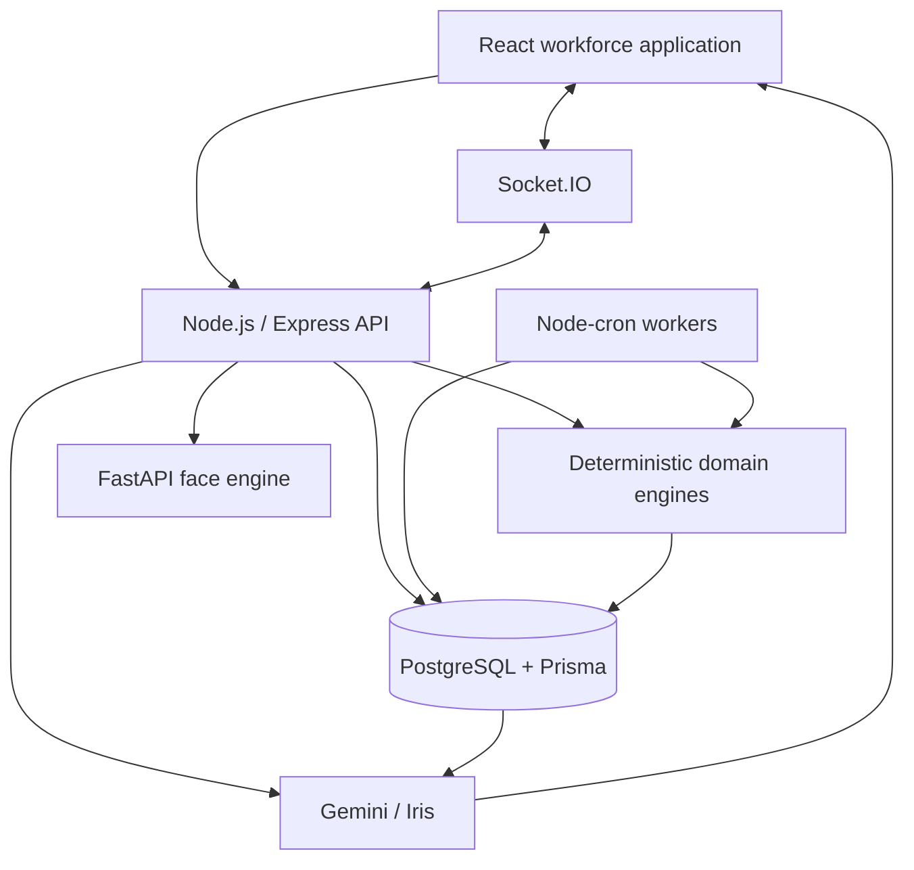
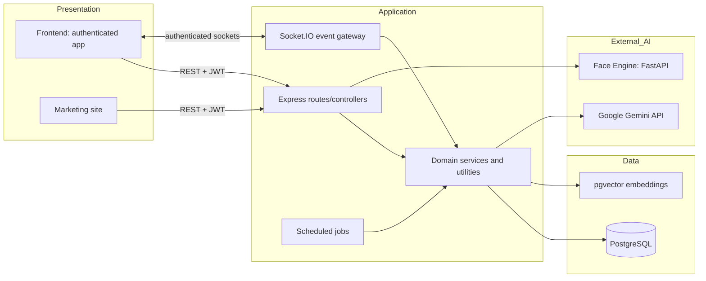
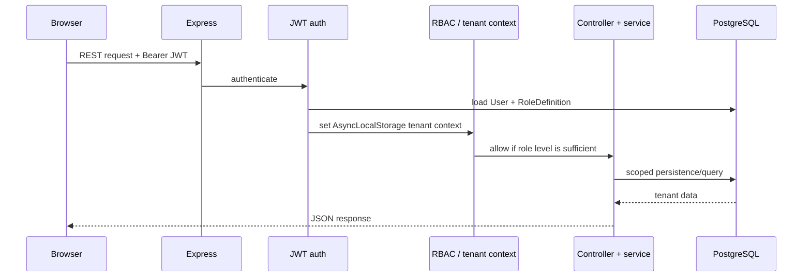
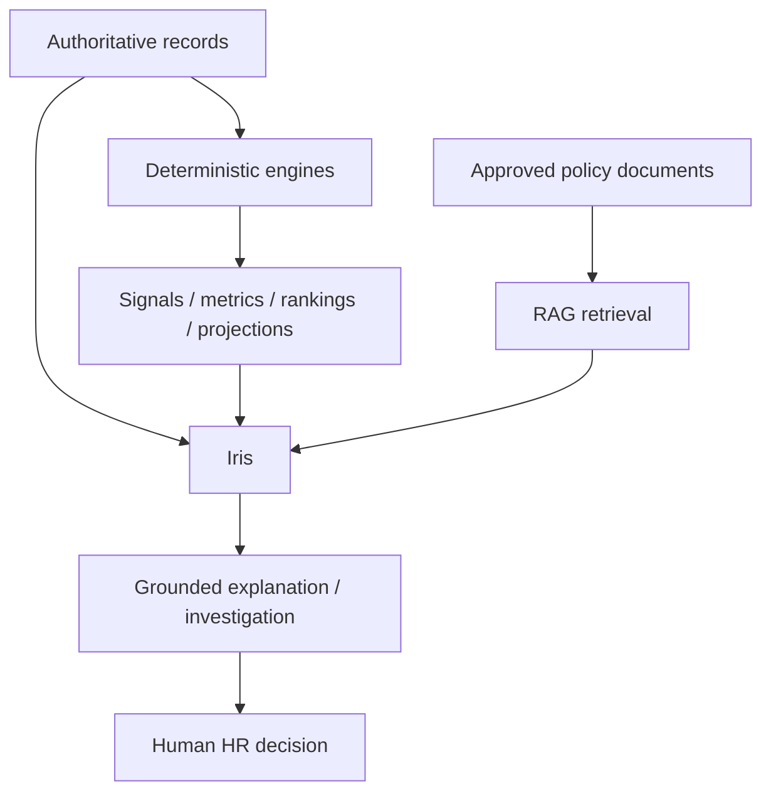

# Crew — Project Architecture Report

**Repository assessed:** `E:\Team-Kratos`  
**Assessment date:** 2026-08-20  
**Primary product:** Crew, a multi-tenant workforce-intelligence platform.  
**Primary AI capability:** Iris, the read-only, RAG-enabled HR intelligence assistant. See [IRIS_ARCHITECTURE_REPORT.md](IRIS_ARCHITECTURE_REPORT.md) for its dedicated design report.

## 1. Executive summary

Crew is a JavaScript/Node monorepo for HR operations and workforce intelligence. It combines a React employee/administrator application, an Express API, PostgreSQL through Prisma, Socket.IO for live events, scheduled jobs, Gemini-backed AI features, and an independent Python face-verification service.

The architecture deliberately separates **systems of record and deterministic engines** from **AI explanation**:

The product scope is broad: tenant and role management; employees; attendance and biometric verification; leave; payroll; expenses and benefits; shifts; onboarding; performance; documents; helpdesk; recruitment/ATS; risk and fraud intelligence; cost intelligence; workforce analytics; and AI-assisted investigation.

## 2. Repository topology

| Area | Technology | Responsibility |
|---|---|---|
| Root | npm workspaces | Coordinates `backend`, `frontend`, `marketing-site`, and reusable packages. |
| `frontend/` | React 19, Vite 8, React Router, Tailwind, Socket.IO client | Authenticated HR/workforce application with 60+ page-level views. |
| `marketing-site/` | React 19, Vite | Public/marketing and account-entry experience. |
| `backend/` | Node.js, Express 5, Prisma 5 | HTTP/Socket API, business logic, integrations, cron scheduling. |
| PostgreSQL | Prisma schema with raw SQL where required | Multi-tenant transactional system of record; pgvector is intended for vector workloads. |
| `face_engine/` | FastAPI, OpenCV, YOLOv8, SFace | In-memory face enrollment and matching service for attendance. |
| `packages/auth-client` | ESM browser utility | Shared login, OTP, reset-password, and local session functions. |
| `packages/socket-client` | ESM browser utility | Shared Socket.IO singleton helper. |
| `packages/shared` | CommonJS | Shared Zod validation exports for leave, onboarding, and performance. |

## 3. Logical architecture

### Architectural style

- A modular monolith: backend routes, controllers, services, jobs, and utilities live in one deployable Node application.
- A single relational database holds tenant-scoped business data, chat history, audit events, metrics, ATS data, and investigation artifacts.
- One separate Python service handles face processing.
- Event-driven behavior is lightweight and in-process: Socket.IO rooms for live updates and `node-cron` for scheduled work. The package set includes BullMQ/Redis, but this repository does not show a configured BullMQ queue worker.
- AI is an application service, not the authority for operational decisions.

## 4. Presentation layer

### Authenticated application

`frontend/src/App.jsx` mounts both the global Iris alert and global chat drawer. Pages are grouped around employee self-service, administrator workflows, and super-administration. The client accesses the backend through `VITE_API_URL` (falling back to `http://localhost:5000`) and stores the JWT plus serialized user profile in `localStorage`.

Key UI domains include:

- Attendance, time off, payroll, timesheets, expenses, benefits, helpdesk, profile, face registration, pulse surveys, documents, and employee dashboard.
- Admin employee management, payroll forecasting, rostering, proxy alerts, recruitment ATS, onboarding, tenant settings, billing, developer settings, audit logs, intelligence radar, workforce cost intelligence, and scenario simulation.
- Super-admin tenant provisioning, tenant details, and cross-tenant dashboard.
- Iris as a dedicated page and a global streaming drawer.

### Public application

The `marketing-site` is a separate Vite application with landing, register, login, password-reset, and dashboard-related components. Both frontends use Vercel SPA rewrite configuration.

### Real-time client behavior

The frontend opens a Socket.IO connection using the JWT in the Socket.IO auth payload. Iris listens for `chatbot:session`, `chatbot:chunk`, `chatbot:done`, and `chatbot:error`. Attendance and operational dashboards can use the same socket server for tenant-room events such as `pulse:update`.

## 5. Backend application layer

`backend/src/server.js` is the composition root. It builds an HTTP server, attaches Socket.IO, starts cron jobs, mounts routes, and implements graceful Prisma shutdown.

### Request pipeline

### API surface

37 backend route modules cover: auth; users and employee aliases; attendance; leave; payroll; superadmin; tenant settings; ATS and rankings; inbox; developer settings; statutory filings; tickets; imports; announcements; billing; assets; projects; one-on-ones; pulse; console; audit; analytics; colocation; face registration; v1 API; onboarding; performance; shifts; expenses; documents; benefits; Iris/chatbot; intelligence; and workforce cost intelligence.

Routes are thin adapters. Controllers implement request validation and state changes; services and utilities implement calculation, integration, and retrieval behavior.

### Domain services and engines

| Capability | Core implementation |
|---|---|
| Attendance and trust | Attendance controller plus `attendanceEngine`, spatial trust, proxy detection, trust score, face matching, shift window, and shift-compliance utilities. |
| Biometric identity | Python face engine, encrypted embedding utility, frontend liveness worker/hooks, and registration/attendance controllers. |
| Leave | Leave controller/routes, ledger utility, renewal/enrollment jobs, leave policies, and leave ledger entries. |
| Shifts | Shift controllers, shift engine, roster simulation service, shift reconciliation/auto-clock-out/mark-absent jobs. |
| Payroll/financials | Payroll controller/calculator, cost intelligence engine, workforce cost service, compliance/filing support, benefits-linked data, expense and salary advance workflows. |
| Recruitment | JD/resume parsers, embedding-backed ATS processing, deterministic ATS scoring, eligibility, rankings, and Gemini explanations. |
| Workforce intelligence | Pattern analysis, risk scoring/explanations, personal baseline metrics, intelligence signals, team intelligence, colocation, metrics, scenario projection, and executive brief. |
| AI and investigations | Iris orchestration, RAG document ingestion/retrieval, tool handlers, Gemini client, investigation reports, and action-plan orchestration. |
| Operational support | Announcements, onboarding, helpdesk tickets, documents/signatures, assets, projects/timesheets, one-on-ones, pulse surveys, notifications, webhooks, and audit logging. |

## 6. Data architecture

### Core relational model

`backend/prisma/schema.prisma` defines 60+ models. `Tenant` is the central partition key. Important entity clusters are:

| Cluster | Principal models |
|---|---|
| Tenant and access | `Tenant`, `RoleDefinition`, `User`, `LegalEntity`, `Office`, `ApiKey`, `AuditLog`, `Subscription`, `UsageRecord`. |
| Workforce operations | `Attendance`, `Leave`, `LeavePolicy`, `LeaveLedgerEntry`, `ShiftPolicy`, `ShiftRoster`, `ShiftSlot`, `ShiftAssignment`. |
| Compensation | `Payroll`, `PayrollConfig`, `SalaryAdvance`, `ExpenseClaim`, `BenefitPlan`, `EmployeeBenefit`, `ComplianceRule`. |
| Employee lifecycle | `Onboarding*`, `Goal`, `Review`, `Feedback360`, `Ticket`, `Asset`, `AssetAssignment`, `Project`, `TimesheetEntry`, `OneOnOne`, `PulseSurvey`, `PulseResponse`. |
| Recruitment | `JobRequisition`, `Candidate`, `Application`, `ATSResult`, `ATSEmbedding`, `CandidateRanking`. |
| Intelligence | `ProxyAlert`, `InvestigationReport`, `IntelligenceProfile`, `IntelligenceSignal`, `WorkforceMetric`, `ScenarioAudit`, `RosterSimulation`, `StrategicActionPlan`, `ColocationGraphCache`. |
| Iris knowledge and memory | `HRDocument`, `ChatSession`, `ChatMessage`. |

### Tenant isolation

The Prisma client (`backend/src/config/db.js`) is extended with `AsyncLocalStorage` tenant context:

1. JWT middleware authenticates a user with unscoped `basePrisma`.
2. It runs the rest of the request inside that user's tenant context.
3. The extended Prisma client injects `tenantId` in reads/writes for non-global models and refuses a query with no tenant context.
4. SuperAdmin is an explicit bypass using `SUPER_ADMIN_BYPASS`.

Controllers that need bootstrap/authentication or raw SQL use `basePrisma` and must explicitly provide the tenant filter. This is particularly important for Iris vector queries and document ingestion.

### Auditability

`AuditLog` writes are overridden to form a per-tenant hash chain. A PostgreSQL advisory transaction lock serializes a tenant's audit writes; each record stores `prevHash` and its computed `hash`. Iris records executed and refused queries, and sensitive tool accesses are separately audited.

## 7. Security architecture

- JWT authentication supports Bearer headers and cookie fallback; users with a pending OTP are blocked except at OTP verification/resend endpoints.
- Role checks are numeric and hierarchical: `authorize(N)` permits roles with `level <= N`. Iris REST routes apply `authorize(1)`, limiting them to Owner/HR Admin tier (with SuperAdmin exception).
- Socket connections independently verify the JWT and reload the user and role definition from the database before joining only server-derived tenant/user/admin rooms.
- Express uses Helmet, CORS allow-list logic, JSON/form size limits of 5 MB, a general API limiter, an auth limiter, and Iris-specific per-user/per-tenant limiters for REST queries.
- Iris system instructions prohibit disclosure of financial-account identifiers, government IDs, personal contact/address data, passwords/OTP, internal UUIDs, and individual salary details.
- RAG filters docs by tenant, role access level, active status, and effective/expiry dates before any content reaches Gemini.
- Face embeddings are encrypted in the Node data layer. The face service processes the submitted image in memory.

## 8. Background and real-time processing

### Scheduled work

`node-cron` scheduling begins at backend startup. Registered jobs include statutory compliance, billing metering, leave renewal, shift reconciliation, onboarding reminders, birthday checks, old 1:1 cleanup, attrition risk scoring, colocation graph computation, mark-absent, monthly workforce metrics, and pattern analysis for dirty intelligence profiles.

### Live processing

The server maintains tenant, admin, admin-pulse, and user Socket.IO rooms. It emits a one-minute `pulse:update` ticker for active tenant pulse dashboards. Iris uses the same socket stack for streamed generation.

### Face engine boundary

`face_engine/main.py` exposes `/register`, `/verify`, and `/ping`:

- YOLOv8 detects a face.
- OpenCV SFace produces a 128-dimensional face encoding.
- The service checks a cosine-match threshold against supplied known encodings.
- Node stores encrypted registered embeddings and uses attendance-side trust/proxy checks.

The current `run_liveness_check` is explicitly a placeholder returning `true`; it is not a production anti-spoofing implementation.

## 9. AI and intelligence boundary

The intended hierarchy is sound: PostgreSQL records, fraud/risk/ATS/scenario engines, and retrieved policies supply facts; Gemini synthesizes explanations. Iris has no write tools for HR records. A user-approved action-plan service exists separately for roster execution, preserving a human approval gate.

## 10. Deployment configuration

- The backend contains a Render web-service definition using Node, `npm install`, and `npm start`, with `PORT=5000`.
- Each React application contains a Vercel configuration that rewrites all routes to `index.html` for SPA routing.
- The face service provides a Dockerfile and can run independently via Uvicorn.
- Runtime secrets/configuration are environment variables, including `JWT_SECRET`, `GEMINI_API_KEY`, `GEMINI_MODEL`, `GEMINI_EMBEDDING_MODEL`, `GEMINI_EMBEDDING_DIMENSIONS`, `AI_MAX_RETRIEVAL_RESULTS`, `AI_SIMILARITY_THRESHOLD`, `AI_MAX_HISTORY_TOKENS`, `AI_MAX_TOOL_CALLS`, `ALLOWED_ORIGINS`, and service-specific credentials.

## 11. Verified architecture risks and gaps

These are observations from the repository, not claims of active production failures.

| Priority | Observation | Consequence / recommendation |
|---|---|---|
| High | Iris's vector SQL reads/writes `HRDocument.embedding`, but the RAG migration shown adds metadata only. The later ATS migration enables `vector` and adds `ATSEmbedding.embedding`, not `HRDocument.embedding`. | Verify the deployed migration history. Add an idempotent migration for `CREATE EXTENSION IF NOT EXISTS vector`, `HRDocument.embedding vector(768)`, and an appropriate ANN index. Without it, policy retrieval catches the SQL failure and silently returns no context. |
| High | Socket Iris queries bypass the REST Iris route and therefore do not pass through REST `authorize(1)` or its Express rate limiters. The socket handler has an alert-context role check, but no universal level-0/1 gate or socket rate limiter. | Apply the same role policy and user/tenant rate limits at `chatbot:query` before session/message creation. |
| High | `run_liveness_check` in the face service returns `true`. | Do not describe this as working anti-spoofing. Integrate and test a real liveness model before relying on it as a security control. |
| Medium | The project has a root lockfile and package manifests but backend `test` exits with an error; no meaningful automated test command is configured. | Add unit tests for tenant guards, role gates, query routing, tool handlers, document extraction, and end-to-end Iris flows. |
| Medium | `executiveBriefService` includes hard-coded period values and mocked attendance/pulse baselines. | Replace with metric-store queries before using executive briefs as operational fact. Label this capability as partially implemented meanwhile. |
| Medium | The general API and auth rate limits are very permissive (2,000 per 15 min and 1,000 per hour). | Revisit limits and add distributed storage if horizontally scaling. |
| Medium | Tenant context protects the extended Prisma client, but `basePrisma` and raw SQL are intentionally unscoped escape hatches. | Maintain code-review rules/tests requiring explicit tenant predicates for every `basePrisma`/raw SQL access. |
| Low | The codebase includes BullMQ and Redis dependencies, but scheduled processing is implemented with in-process cron. | Use a durable queue/worker strategy if jobs must survive restarts or run across multiple backend replicas. |

## 12. Recommended evolutionary roadmap

1. Close the Iris vector schema/deployment gap and add retrieval integration tests with two tenants and three access levels.
2. Centralize authorization and rate limiting so REST and Socket.IO use the same Iris policy enforcement.
3. Move scheduled work and any long-running ATS/AI jobs to durable workers with retry, idempotency, observability, and one scheduler leader.
4. Add database row-level security as defense in depth if the operational model supports it; retain application-level tenant guards.
5. Add structured operational telemetry: model/embedding latency, retrieval hit rate, tool failure rate, response feedback, queue/job results, and alert investigations.
6. Turn mocked intelligence values into versioned `WorkforceMetric` data and display data freshness/coverage consistently.
7. Complete liveness verification and perform privacy/security review of biometrics, retention, consent, encryption, and incident processes.

## 13. Source map

- Application bootstrap: `backend/src/server.js`
- Data tenancy/audit extension: `backend/src/config/db.js`, `backend/src/middleware/auth.js`, `backend/src/middleware/role.js`
- Schema: `backend/prisma/schema.prisma`
- Iris: `backend/src/routes/chatbot.js`, `backend/src/controllers/chatbotController.js`, `backend/src/services/chatOrchestrator.js`
- RAG: `backend/src/services/documentIngestion.js`, `documentExtractor.js`, `embeddings.js`, `vectorSearch.js`
- UI: `frontend/src/pages/AIChatbot.jsx`, `frontend/src/components/chatbot/*`
- Scheduling: `backend/src/workers/cronJobs.js`
- Face service: `face_engine/main.py`, `face_engine/face_utils.py`
