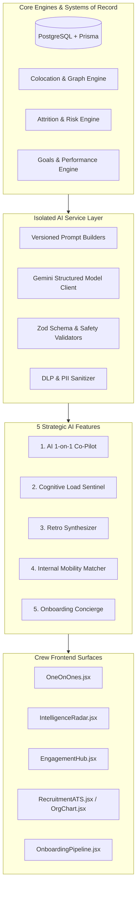
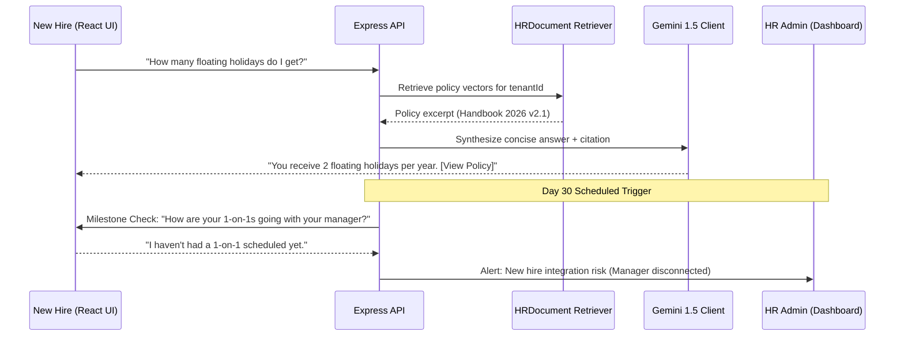

# AI in Workplace & Team Dynamics — Comprehensive Feature Specification Plan

**Product:** Crew (Team Kratos)  
**Domain:** AI in Workplace (HR, Team Dynamics & Workforce Intelligence)  
**Status:** Architectural Blueprint & Implementation Specification  
**Version:** 1.0  
**Date:** 2026-08-22  

---

## 1. Executive Overview & Architectural Foundations

This document details five strategic AI-powered workplace and team dynamics features designed for **Crew**. Each feature builds directly upon Crew's verified architecture:
- **Presentation:** React 19 + Tailwind CSS + Socket.IO client
- **Backend:** Node.js / Express 5 + Prisma ORM + PostgreSQL
- **AI Core:** Google Gemini Client with strictly bounded structured output and deterministic scoring
- **Tenant Isolation:** AsyncLocalStorage `tenantId` injection and multi-tenant security
- **Core Product Axiom:** *AI proposes; deterministic code validates and scores; humans decide.*



---

## 2. Feature 1: AI 1-on-1 Intelligent Co-Pilot & Growth Coach

### 2.1 Problem Statement & Objectives
One-on-one meetings are the primary vehicle for retention, alignment, and psychological safety, but managers frequently:
- Fall into transactional status updates rather than career coaching.
- Lack time to review historical check-in commitments, time-off patterns, or recent performance feedback.
- Struggle to formulate empathetic, non-confrontational questions during stressful sprint periods.

### 2.2 User Journey & Wireframe Architecture
1. **Pre-Meeting Intelligence (24h before):** The manager opens `frontend/src/pages/OneOnOnes.jsx`. A private badge says **"Iris Co-Pilot Brief Ready"**.
2. **Context Synthesis:** Iris presents 3 recommended talking points, 2 open-ended growth questions, and unresolved action items from the previous meeting.
3. **In-Meeting Collaboration:** Both parties check off items and add live notes.
4. **Post-Meeting Synthesis:** Manager clicks **"Summarize & Extract Commitments"**. The AI extracts structured action items with assigned owners and creates calendar follow-ups.

### 2.3 Data Model Extensions (`schema.prisma`)
```prisma
model OneOnOneAIBrief {
  id               String      @id @default(uuid())
  tenantId         String
  tenant           Tenant      @relation(fields: [tenantId], references: [id])
  oneOnOneId       String      @unique
  oneOnOne         OneOnOne    @relation(fields: [oneOnOneId], references: [id], onDelete: Cascade)
  suggestedTopics  Json        // Array of { category: 'Goal' | 'Wellbeing' | 'Feedback', topic: string, contextSnippet: string }
  coachingPrompts  String[]    // 2-3 empathetic probing questions
  unresolvedItems  Json        // Carry-over items from previous OneOnOne
  summary          String?     @db.Text
  generatedAt      DateTime    @default(now())

  @@index([tenantId, oneOnOneId])
}
```

### 2.4 API Contract & Endpoints
- `GET /api/one-on-ones/:id/ai-brief` — Fetches or lazily generates the pre-meeting prep briefing. (Gated to `managerId` or `employeeId`).
- `POST /api/one-on-ones/:id/ai-summarize` — Takes meeting notes text, validates DLP, and returns structured `{ actionItems: [{ text, assigneeId }], keyDecisions: [] }`.

### 2.5 Privacy & Security Guardrails
- **Strict Role Isolation:** Pre-meeting prompts never disclose private compensation data, medical leaves, or peer 360 review text that wasn't explicitly shared with the manager.
- **DLP Sanitization:** Raw meeting notes pass through `inputGuard` before LLM processing; no raw prompts logged.

---

## 3. Feature 2: Team Cognitive Load & Meeting Friction Sentinel

### 3.1 Problem Statement & Objectives
Knowledge workers suffer from fragmented schedules, excessive context-switching, and uneven meeting loads across cross-functional silos. Traditional attendance software only records clock-in/out, missing the hidden burnout caused by hyper-fragmented focus time.

### 3.2 Analytical Engine & Deterministic Scoring
Instead of relying on AI hallucinations for metrics, Crew calculates a **0–100 Cognitive Load Index (CLI)** in deterministic server code (`cognitiveLoadEngine.js`):

$$\text{CLI} = 0.35 \times \text{FragmentationScore} + 0.30 \times \text{OvertimePressure} + 0.20 \times \text{ColocationLinkDensity} + 0.15 \times \text{ShiftDisruption}$$

```
Metric Weights:
- FragmentationScore: Percentage of workdays with <2-hour contiguous focus blocks.
- OvertimePressure: Ratio of check-outs past shift scheduled end time (>45 mins).
- ColocationLinkDensity: Number of cross-department synchronization dependencies from ColocationGraphCache.
- ShiftDisruption: Emergency schedule swaps or split shifts in ShiftRoster.
```

### 3.3 Data Model Extensions (`schema.prisma`)
```prisma
model TeamCognitiveLoadMetric {
  id                 String   @id @default(uuid())
  tenantId           String
  tenant             Tenant   @relation(fields: [tenantId], references: [id])
  department         String
  computedDate       DateTime @default(now())
  cognitiveLoadIndex Int      // 0 - 100
  fragmentationScore Int      // 0 - 100
  overtimePressure   Int      // 0 - 100
  focalBlockHours    Float
  frictionDrivers    String[] // e.g. ["Cross-Department Standup Overlap", "Consecutive Late Shifts"]
  aiMitigationNudge  String?  @db.Text

  @@unique([tenantId, department, computedDate])
  @@index([tenantId, computedDate])
}
```

### 3.4 Operational AI Nudges (Intelligence Radar UI)
When CLI exceeds `65` (High) for a department, Gemini generates an operational recommendation for leadership:
* *Example:* "Engineering (Backend) focus blocks dropped by 42% on Tuesdays due to cross-functional status calls. Recommendation: Propose 'No-Meeting Tuesdays' or shift sprint planning to asynchronous feeds in Engagement Hub."

---

## 4. Feature 3: Psychological Safety & Blame-Free Retrospective Synthesizer

### 4.1 Problem Statement & Objectives
Sprint retrospectives and departmental post-mortems often suffer from:
- Junior employees fearing negative career repercussions for speaking up.
- Blaming language between departments (e.g. QA vs Dev, Product vs Design).
- Scattered feedback that lacks actionable, structured synthesis.

### 4.2 Application Workflow
```
[Team Members submit async feedback]
              ↓
[DLP & De-Identification Guard]
  - Strips employee names, individual timestamps & specific vernacular
              ↓
[Gemini Semantic Clustering Engine]
  - Clusters into 4 Quadrants: What Went Well, Friction Points, Process Gaps, Team Appreciations
  - Rewrites all friction points into Blame-Free Problem Statements
              ↓
[Team Lead / Scrum Master Dashboard]
  - Displays Theme Cards with Vote Counts + AI-Drafted Action Experiments
```

### 4.3 Data Model Extensions (`schema.prisma`)
```prisma
model RetrospectiveSession {
  id             String                @id @default(uuid())
  tenantId       String
  tenant         Tenant                @relation(fields: [tenantId], references: [id])
  department     String
  title          String
  status         String                @default("OPEN") // OPEN, SYNTHESIZING, COMPLETED
  createdAt      DateTime              @default(now())
  closedAt       DateTime?
  submissions    RetroSubmission[]
  themes         RetroSynthesizedTheme[]
}

model RetroSubmission {
  id             String               @id @default(uuid())
  tenantId       String
  sessionId      String
  session        RetrospectiveSession @relation(fields: [sessionId], references: [id], onDelete: Cascade)
  respondentHash String               // HMAC-SHA-256 for one submission per employee
  category       String               // 'WentWell' | 'Friction' | 'Idea' | 'Appreciation'
  content        String               @db.Text
  createdAt      DateTime             @default(now())

  @@unique([sessionId, respondentHash])
}

model RetroSynthesizedTheme {
  id             String               @id @default(uuid())
  tenantId       String
  sessionId      String
  session        RetrospectiveSession @relation(fields: [sessionId], references: [id], onDelete: Cascade)
  category       String
  themeTitle     String
  neutralSummary String               @db.Text
  mentionCount   Int                  @default(1)
  suggestedTrial String               @db.Text // AI Proposed actionable experiment
}
```

### 4.4 Non-Blame Neutral Rewriting Rules
The prompt builder enforces:
1. Transform individual blame into systemic/process constraints (e.g., *"John never tests his PRs"* $\rightarrow$ *"CI/CD integration testing lacks automated pre-merge gating"*).
2. Suppress any identifying references to gender, seniority, or specific incident timestamps.

---

## 5. Feature 4: Living Skills Graph & Internal Talent Mobility Matcher

### 5.1 Problem Statement & Objectives
Companies spend thousands hiring externally while internal candidates with 80%+ overlapping skills leave due to lack of visibility into career pathways. HR lacks an automated way to map talent supply against requisition demand.

### 5.2 Technical Architecture
```
[Completed Goals + Reviews + Job Requisitions]
                       ↓
[Skill Extraction & Standardization Pipeline]
  - Maps freeform descriptions to standardized ESCO / O*NET Skill Taxonomy
                       ↓
[Embedding & Vector Matching (pgvector)]
  - Compares User Skill Profile with JobRequisition Requirements
                       ↓
[Career Path & Gap Bridge Generator]
  - Outputs Match Percentage (0-100%) + Exact Bridge Actions (Courses, Mentorships)
```

### 5.3 Data Model Extensions (`schema.prisma`)
```prisma
model UserSkill {
  id             String   @id @default(uuid())
  tenantId       String
  tenant         Tenant   @relation(fields: [tenantId], references: [id])
  userId         String
  user           User     @relation(fields: [userId], references: [id], onDelete: Cascade)
  skillName      String
  category       String   // 'Technical' | 'Domain' | 'Leadership' | 'Methodology'
  proficiency    String   // 'Beginner' | 'Intermediate' | 'Advanced' | 'Expert'
  source         String   // 'PerformanceReview' | 'GoalAchievement' | 'SelfReported' | 'Credential'
  verified       Boolean  @default(false)
  updatedAt      DateTime @updatedAt

  @@unique([tenantId, userId, skillName])
  @@index([tenantId, skillName])
}

model InternalMobilityMatch {
  id             String         @id @default(uuid())
  tenantId       String
  userId         String
  jobId          String
  job            JobRequisition @relation(fields: [jobId], references: [id], onDelete: Cascade)
  matchScore     Int            // 0 - 100
  matchingSkills String[]
  skillGaps      String[]
  upskillingPlan Json           // Step-by-step milestones to qualify
  createdAt      DateTime       @default(now())

  @@unique([userId, jobId])
  @@index([tenantId, matchScore])
}
```

### 5.4 Employee Empowerment & Privacy Guardrails
- Internal matches are **private to the employee** by default. Managers cannot see which open roles their direct reports are browsing until the employee submits an internal transfer application.
- Matches evaluate skills and documented outcomes only; age, tenure, compensation, and marital status are strictly excluded from vector scoring.

---

## 6. Feature 5: Interactive AI Onboarding Concierge & 30-60-90 Milestone Buddy

### 6.1 Problem Statement & Objectives
40% of employee turnover occurs within the first 90 days. New hires suffer from "information overload" during week 1 and "silent isolation" between weeks 3 and 12, struggling to locate HR policies, setup guides, and project contexts.

### 6.2 Conversational RAG Architecture
The Onboarding Concierge leverages Crew's existing `HRDocument` and `OnboardingTask` infrastructure:
1. **Document Retrieval (RAG):** Answers new hire queries (e.g. *"What is the parental leave policy?"*, *"How do I submit meal expenses during travel?"*) citing exact tenant documents.
2. **Proactive 30-60-90 Day Checkpoints:** Scheduled automated triggers at Day 14, 30, 60, and 90 evaluate sentiment, task velocity, and alignment.



### 6.3 Data Model Extensions (`schema.prisma`)
```prisma
model OnboardingMilestoneCheck {
  id              String         @id @default(uuid())
  tenantId        String
  tenant          Tenant         @relation(fields: [tenantId], references: [id])
  userId          String
  user            User           @relation(fields: [userId], references: [id], onDelete: Cascade)
  milestoneDay    Int            // 14, 30, 60, 90
  status          String         @default("PENDING") // PENDING, COMPLETED, FLAGGED
  sentimentRating Int?           // 1 to 5
  blockers        String?        @db.Text
  managerSyncOk   Boolean?
  aiRampUpScore   Int?           // 0 - 100 calculated from checklist completion & check-in
  hrFollowUpNeeded Boolean       @default(false)
  completedAt     DateTime?
  createdAt       DateTime       @default(now())

  @@unique([tenantId, userId, milestoneDay])
}
```

---

## 7. Cross-Feature Technical Standards & Security Gates

### 7.1 Multi-Tenant Isolation
All new tables include `tenantId` linked to `Tenant(id)`. Lookups in controllers execute through `prisma.basePrisma` with explicit `tenantId` matches to comply with Crew's AsyncLocalStorage extension in `backend/src/config/db.js`.

### 7.2 Strict Rate Limiting & Fail-Closed Guardrails
All LLM endpoints pass through `cacheManager.getRedisHealth()`:
- User rate limit: 15 AI actions/user/hour
- Tenant rate limit: 250 AI actions/tenant/day
- If Redis is unreachable, fail closed with HTTP 503 `FEATURE_DISABLED` to prevent unbounded model costs.

### 7.3 Log Sanitization & PII Protection
- All prompts pass through `communicationReviewInputGuard.js` to strip credit cards, national ID numbers, and passwords.
- Application and server logs record only `{ event, tenantId, userId, latencyMs, status }`; raw conversation transcripts are excluded from standard server logs.

---

## 8. Implementation Roadmap & Phasing

| Milestone | Deliverables | Target Timeline |
|---|---|---|
| **Phase 1** | **AI 1-on-1 Co-Pilot (Feature 1)**<br>• `OneOnOneAIBrief` Prisma model & migration<br>• Pre-meeting synthesis engine & prompt templates<br>• UI integration in `OneOnOnes.jsx` | 2 Sprints |
| **Phase 2** | **Cognitive Load Sentinel (Feature 2)**<br>• `cognitiveLoadEngine.js` deterministic CLI calculation<br>• Cron aggregation job in `cronJobs.js`<br>• Radar chart widget in `IntelligenceRadar.jsx` | 2 Sprints |
| **Phase 3** | **Retrospective Synthesizer (Feature 3)**<br>• Async submission portal in `EngagementHub.jsx`<br>• De-identification and clustering pipeline<br>• Action experiment drafting engine | 2 Sprints |
| **Phase 4** | **Onboarding Concierge & Buddy (Feature 5)**<br>• 30-60-90 Day milestone check triggers<br>• RAG connector to `HRDocument`<br>• Employee chat assistant in `OnboardingPipeline.jsx` | 2 Sprints |
| **Phase 5** | **Living Skills Graph & Mobility (Feature 4)**<br>• Skill taxonomy extractor from Goals & Reviews<br>• Vector matching engine with `JobRequisition`<br>• Career Path Navigator UI in `EmployeeDirectory.jsx` | 3 Sprints |

---

## 9. Next Steps

To begin implementation, select your preferred feature priority:
1. **Option A:** Start with **Feature 1 (AI 1-on-1 Co-Pilot)** for immediate manager productivity impact.
2. **Option B:** Start with **Feature 2 (Cognitive Load Sentinel)** to expand Crew's Intelligence Radar analytics.
3. **Option C:** Start with **Feature 3 (Blame-Free Retro Synthesizer)** to complement the Communication Stress-Testing launch in Engagement Hub.
