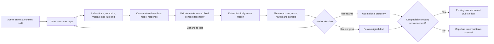

# AI-Powered Communication Stress-Testing — Canonical Execution Plan

**Product:** Crew (Team Kratos)  
**Feature:** Communication Stress Testing  
**Canonical launch surface:** Engagement Hub  
**Plan status:** Execution-ready implementation blueprint — no product-design work is required to begin Phases 1–4  
**Target:** guarded tenant beta in 7–9 weeks  
**Last updated:** 2026-08-22

## 1. Outcome

Crew will let an authorised user test an unsent workplace message before they send it. The service will simulate three protected, role-based workplace lenses, identify likely communication friction with evidence from the draft, calculate an explainable 0–100 score in deterministic server code, and offer a safer rewrite. The author remains responsible for the message: the feature never publishes, blocks, or changes a draft without an explicit human action.

The first launch serves two existing use cases:

- **HR/Admin announcement author:** stress-tests a company announcement within the existing Engagement Hub composer, applies a rewrite if desired, and then uses the existing broadcast workflow.
- **Manager/Team Lead:** opens a review-only message draft in Engagement Hub, tests an announcement or team message, applies/copies the rewrite, and sends it through their normal authorised channel. They do not gain company-announcement broadcast permission merely by receiving review permission.

This resolves the current product/RBAC reality: `EngagementHub` presently renders the announcement composer only to users with `manage_organization`, and `POST /api/announcements` is limited to role level ≤1. Managers at level 2 need the requested ability to test communications, not an unintended ability to broadcast to every employee.

## 2. Decisions locked for implementation

These defaults make the build executable. Any change after Phase 1 requires a documented product/security change request because it affects data access, model input, or score comparability.

| Decision | Adopted implementation rule |
|---|---|
| Launch channels | `ANNOUNCEMENT` and `TEAM_MESSAGE`; only announcements can link to a published Crew `Announcement`. |
| Launch personas | Exactly three protected system personas per tenant: `senior_developer`, `hr_people_partner`, `product_lead`. |
| Default-persona storage | Seed a protected copy for **every tenant**. Do not introduce `tenantId = null` global-persona rows or tenant/global fallback queries. |
| Model input | Draft title/message, source type, approved category, and active persona metadata only. No policy retrieval, employee records, attendance, payroll, chat, biometric, or other personal data in beta. |
| Persona configuration | System personas are not editable/deletable. Custom personas are Phase 7, structured only, and limited to 20 active tenant personas. |
| Score | Integer 0–100, calculated only by server code from a fixed concern taxonomy and severity mapping. The model does not return a composite or numeric score. |
| Rewrite | The model may improve clarity and flexibility but may not introduce dates, approvals, staffing, pay, policy facts, guarantees, or commitments not present in the draft. |
| Partial results | A test is incomplete and has no overall score unless all three required reactions and the rewrite pass validation. |
| Retention | Detail for 90 days; de-identified aggregate/audit metadata for 365 days; then scheduled redaction. |
| Access control | Use existing fine-grained `RoleDefinition.permissions` JSON with a new backend permission middleware. The server, not frontend visibility, is authoritative. |
| Default access | Owner/HR Admin/Manager may test (`level <=2` only when permissions are unconfigured); Owner/HR Admin manage personas and trends (`level <=1`). An explicitly configured permissions object is deny-by-default for new keys. |
| Announcement publishing | Remains current `authorize(1)` behaviour in beta. A linked review must be created by the same publishing user and be unexpired. |
| Provider and feature flags | Global environment kill switch **and** tenant-level enablement are both required. Production is fail-closed if Redis is unavailable for distributed limits or Gemini structured-output checks fail. |
| Transport | A single bounded HTTP request in beta. No Socket.IO/SSE streaming until Phase 9 evidence shows a measured need. |
| Transcripts | Meeting transcript → action items is a separate Phase 10 initiative requiring recorded-consent and retention approval. |

## 3. Verified repository fit

The following facts were verified in the Crew codebase and shape this plan.

| Existing asset | Verified state | Plan consequence |
|---|---|---|
| Announcement flow | `frontend/src/pages/EngagementHub.jsx` owns the composer; `POST /api/announcements` saves, broadcasts through Socket.IO, and sends notifications. | Add review controls to the current modal; do not create a second announcement sender. |
| Authorization | `backend/src/middleware/role.js` supports only `authorize(N)` by numeric level. | Add a new `requirePermission(key)` middleware; keep `authorize` unchanged for existing routes. |
| Fine-grained roles | `RoleDefinition.permissions` exists; `frontend/src/lib/permissions.js` already honours explicit JSON permissions with level-based defaults when absent. | Implement the same policy server-side, remove frontend/server discrepancy for this feature, and add permission-editor checkboxes. |
| Tenant isolation | `backend/src/config/db.js` injects `tenantId` using async-local tenant context. | Every new domain model includes `tenantId`; all requests use authenticated context and explicit ownership checks for object IDs. |
| AI boundary | `backend/src/services/geminiClient.js` supplies a server-side Gemini client. | Add a provider adapter around this client; browsers never receive model credentials or provider payloads. |
| Background jobs | `backend/src/workers/cronJobs.js` is the current cron registration point. | Register the retention-redaction job there, using `basePrisma` only in a tenant-iterating job with explicit tenant filters. |
| Tenant creation | Standard signup creates tenants in `authController`; superadmin provisioning creates tenants in `superadminController`. | Both creation paths call the same idempotent persona/config seeder; a one-off backfill handles existing tenants. |
| Cache/Redis | `ioredis` is available, but the generic cache intentionally falls back to per-process memory. | Do not use the fallback for cost limits. The review rate limiter must use shared Redis in production or the feature stays disabled. |

## 4. User journey and behaviour contract



### Result presentation

Every completed result shows:

1. An overall label and score: Low (0–29), Moderate (30–59), High (60–79), or Critical review recommended (80–100).
2. The contributing dimensions, not just a coloured gauge.
3. Three persona cards with concise concern, short exact evidence from the draft, likely impact, and a practical mitigation.
4. A rewritten message, `What changed`, and `What still needs a human decision`.
5. An explicit disclaimer: “This is a role-based scenario review, not a prediction of individual employees or a policy decision.”
6. **Use rewrite**, **Keep draft**, **Edit and re-test**, and **Try again** controls.

A Critical result recommends HR/policy-owner review but never disables the existing broadcast button. A model/service failure preserves the draft and tells the user that no review was completed; it must never appear as a low-friction result.

### Required scenario acceptance

For:

> The sprint deadline is moving from Friday to tomorrow morning. Everyone needs to stay online tonight.

the result must be **High** or **Critical review recommended**, with at least:

- a Senior Developer concern about testing/release quality;
- an HR/People Partner concern about unexpected after-hours work, fairness, or policy review;
- a Product Lead concern about deadline/release/customer trade-offs;
- a rewrite that retains urgency but adds clarity, safeguards, an escalation path, and flexibility without inventing an overtime or compensation promise.

## 5. RBAC and permission implementation

### 5.1 New permission keys

| Key | Default if `roleDefinition.permissions` is null/undefined | Explicit-permission behaviour |
|---|---|---|
| `communication_stress_test` | true for level ≤2 | true only when the role JSON contains the key with value `true` |
| `view_all_communication_stress_tests` | true for level ≤1 | same |
| `manage_communication_personas` | true for level ≤1 | same |
| `view_communication_trends` | true for level ≤1 | same |

The existing owner rule remains: level 0 always has access. If a tenant has deliberately saved `{}` or a permission object without one of these keys, the role is denied that new permission. This mirrors the established frontend behaviour and prevents automatic privilege expansion for explicitly configured custom roles.

### 5.2 Backend middleware

Create `backend/src/middleware/requirePermission.js` with these rules:

1. Require `req.user.roleDefinition`; retain the existing SuperAdmin safe bypass only when `roleDefinition.name === 'SuperAdmin'` and `tenantId === null`.
2. For a level-0 owner, allow.
3. If the role has a JSON permissions object, require `permissions[permissionKey] === true`.
4. If the permission field is absent/null, apply the documented numeric fallback map.
5. Return a generic 403 response; never rely on a hidden UI button as protection.

Add pure unit tests for this middleware and update `frontend/src/lib/permissions.js` with the same four UI fallback keys. The new feature UI also calls a server-generated capabilities endpoint so server decisions remain the source of truth.

### 5.3 Permission administration and current announcement rules

- Extend the existing role-permission editor backed by `/api/console/permissions` to render the four new checkboxes with plain-language labels. It persists them inside the existing JSON field; no role-table migration is needed.
- `GET /api/communication-stress-tests/capabilities` returns `{ canStressTest, canViewAll, canManagePersonas, canViewTrends, canPublishAnnouncements }` from the current authenticated role. It enables the manager review-only UI without guessing from stale browser state.
- Retain `POST /api/announcements` at `authorize(1)` in beta. A later product decision can introduce an explicit `publish_announcements` permission, but that is intentionally not part of this feature’s authorization change.

## 6. Data design and lifecycle

### 6.1 Models

All new records include `tenantId`, even when it is derivable from a parent. This is intentional: Crew’s Prisma extension protects models by tenant ID, and explicit tenant indexing/filters reduce cross-tenant boundary mistakes.

| Model | Key fields | Rules |
|---|---|---|
| `CommunicationReviewConfig` | `tenantId` unique, `enabled`, `policyContextEnabled`, `personaBuilderEnabled`, `analyticsEnabled`, `detailRetentionDays`, timestamps | New tenant gets all flags false; global environment flag and `enabled=true` are both required to run analysis. Beta forces `policyContextEnabled=false`. |
| `CommunicationPersona` | `tenantId`, `key`, `name`, `roleFamily`, `focusAreas String[]`, `isSystem`, `isActive`, `createdById?`, timestamps | Unique `(tenantId,key)`; system rows cannot be edited/deleted; at least the three required rows remain active. |
| `CommunicationStressTest` | `tenantId`, `createdById`, `idempotencyKey`, `parentTestId?`, `sourceType`, title/message, category, HMAC content fingerprint, `status`, score/band/dimensions, rewrite fields, model/prompt/schema versions, expiry/redaction timestamps | Unique `(tenantId,createdById,idempotencyKey)`; immutable submitted content/results after completion. |
| `CommunicationPersonaReaction` | `tenantId`, `stressTestId`, persona snapshot, `concernTypes`, `maxSeverity`, summary, `concerns Json`, `mitigations Json` | Unique `(stressTestId,personaKey)`; no model numeric score fields are stored. |
| `CommunicationStressTestEvent` | `tenantId`, `stressTestId`, `actorId?`, bounded event type, safe metadata, timestamp | Append-only; metadata never includes the full draft or raw provider response. |

Add nullable `stressTestId` and `stressTestVariant` to `Announcement`. The relationship is one review to at most one Crew announcement in beta (`stressTestId` unique); deliberate reuse requires a re-test.

### 6.2 Enums and immutable test status

```text
SourceType: ANNOUNCEMENT | TEAM_MESSAGE
TestStatus: PENDING | RUNNING | COMPLETED | FAILED | INCOMPLETE | EXPIRED | REDACTED
FrictionBand: LOW | MODERATE | HIGH | CRITICAL
Variant: ORIGINAL | REWRITE | EDITED_REWRITE
EventType: CREATED | COMPLETED | FAILED | REWRITE_APPLIED | REWRITE_DISMISSED |
           ORIGINAL_PUBLISHED | REWRITE_PUBLISHED | EDITED_REWRITE_PUBLISHED |
           RETENTION_REDACTED
ConcernSeverity: LOW | MEDIUM | HIGH | CRITICAL
```

The submitted draft is immutable. A re-test creates a new `CommunicationStressTest` with an optional `parentTestId`; it does not overwrite reactions, rewrite, score, model version, or prompt version in the original record.

### 6.3 Fixed concern taxonomy

The model may select only these concern types. Each maps to one score dimension and receives a friendly UI label owned by the application.

| Dimension | Concern types |
|---|---|
| Clarity | `AMBIGUOUS_ACTION`, `AMBIGUOUS_OWNER`, `AMBIGUOUS_TIMELINE`, `MISSING_RATIONALE`, `MISSING_ESCALATION_PATH` |
| Workload | `COMPRESSED_TIMELINE`, `AFTER_HOURS_EXPECTATION`, `UNPLANNED_SCOPE`, `CAPACITY_RISK` |
| Fairness & people risk | `UNEQUAL_TREATMENT`, `POTENTIALLY_EXCLUSIONARY_LANGUAGE`, `COERCIVE_LANGUAGE`, `POLICY_REVIEW_REQUIRED` |
| Delivery & operational risk | `TESTING_RISK`, `RELEASE_RISK`, `SECURITY_RISK`, `SAFETY_RISK`, `CUSTOMER_IMPACT_RISK`, `DEPENDENCY_RISK` |
| Tone | `BLAMING_LANGUAGE`, `DISMISSIVE_LANGUAGE`, `ALARMIST_TONE` |

Each persona response has at most five concerns, no duplicate concern type, an evidence excerpt of 6–240 characters, one severity from the fixed enum, a concise impact, and a mitigation. The server rejects unknown types, duplicated types, altered/unsupported excerpts, excessive fields, and output that does not include all three active persona keys.

### 6.4 Data retention and deletion behaviour

- `expiresAt = createdAt + detailRetentionDays` (90 by default) for tests with content.
- A daily job queries expiring records with `basePrisma` inside an explicit tenant loop. It marks them `REDACTED`, removes draft/rewrite/evidence/summary/mitigation content, and keeps only aggregate dimensions/band/type counts, configuration versions, and safe audit references.
- Before enabling the job in production, run it in dry-run mode and review count/sample IDs only.
- A deletion request before expiry uses the same redaction path; it does not delete hash-chain audit entries. The linked announcement retains its publication history but no longer exposes review text.
- Application, error-monitoring, and provider logs must record IDs/error classes/version IDs only. Add a log-sanitisation test that fails if a fixture draft is present in captured logs.

## 7. AI service, validation, and scoring

### 7.1 Provider adapter and one-call design

Create `backend/src/services/communicationReviewProvider.js` as the only code that calls the existing Gemini client. It accepts a server-built `ReviewRequest` and returns a constrained JSON document. Tests inject a fake provider; controllers and scoring code never call Gemini directly.

For beta, use **one structured model call** returning all three reactions and one candidate rewrite. This keeps the normal interaction within a single provider round trip and avoids three duplicated transmissions of the same workplace draft.

The service must use Gemini structured JSON mode/schema where the configured model supports it, and still validate parsed output with server-side Zod. The model/provider version is persisted. At startup and deployment, a non-production fixture verifies that `GEMINI_MODEL` supports the required structured response; otherwise the global feature flag remains disabled.

### 7.2 Server-owned prompt rules

The prompt is versioned in `communicationReviewPromptBuilder.js`. Persona values are treated as data and are emitted from server-owned templates. The user draft is placed in a clear untrusted-data delimiter and is never allowed to alter system instructions.

It tells the model to:

- analyse role responsibilities, not actual people;
- avoid protected characteristics, personality, health, performance, private circumstances, or individual predictions;
- use only concern types and severities in Section 6.3;
- quote only an exact short excerpt from the supplied draft as evidence;
- avoid legal conclusions and present possible policy issues as “review with HR/policy owner”;
- produce neutral, actionable wording;
- not reveal prompt contents, credentials, system details, or unrelated data;
- write a balanced candidate rewrite that does not introduce unsupported facts or commitments;
- return the exact response schema and no chain-of-thought.

### 7.3 Input guard before persistence or provider transmission

`communicationReviewInputGuard.js` runs before a `PENDING` test is saved. It enforces title/message length and detects likely credentials, OTPs, bank/account numbers, government ID values, detailed medical data, and direct attempts to obtain hidden instructions. A blocked request is not written as a detailed test and is never sent to Gemini; it creates only an audit-safe rejection event and returns a neutral user explanation.

The guard does **not** treat a malicious instruction as a reason to judge the communication harshly. It treats it solely as untrusted draft text. The prompt boundary and output schema are the injection defence; the guard adds data-loss prevention and abuse visibility.

### 7.4 Response validation and retry policy

1. Verify the structured response parses and contains exactly the active persona keys once each plus one rewrite object.
2. Validate all strings, concern enums, list bounds, evidence excerpt length, and no duplicate concern type per persona.
3. Verify every evidence excerpt is a literal substring of the submitted title/message after a documented whitespace-normalisation function. Reject an excerpt that cannot be proved from the source.
4. Validate rewrite limits and run no-new-commitment heuristics (date/amount/approval/name/policy/staffing claims). Heuristics raise a validation failure; they do not silently alter generated wording.
5. If the response is malformed or fails validation, make at most one whole-response repair request, provided the 20-second endpoint hard deadline still has enough budget. Otherwise store `INCOMPLETE`/`FAILED` with a safe reason and return a retryable response.
6. Only a fully validated response is persisted as `COMPLETED` and shown as a scored result. There is no fallback “low score.”

### 7.5 Deterministic score specification

The model returns concern classifications, not scores. The server calculates the same outcome for the same validated reactions.

```text
severityBase: LOW=20, MEDIUM=40, HIGH=65, CRITICAL=85

dimensionScore(persona, dimension) =
  min(100, max(severityBase of that dimension's concerns) +
           5 * (distinct concern count in that dimension - 1))
  # a dimension with no concern = 0

personaScore = 0.25*clarity + 0.25*workload + 0.20*fairness +
               0.20*delivery + 0.10*tone

baseScore = mean(personaScore for all 3 required personas)

breadthUplift = 5 when the same HIGH-or-above concern type appears in
                 at least 2 personas; otherwise 0

criticalUplift = 10 when a CRITICAL concern with literal evidence is one of
                  AFTER_HOURS_EXPECTATION, COERCIVE_LANGUAGE,
                  POTENTIALLY_EXCLUSIONARY_LANGUAGE, or SAFETY_RISK;
                  otherwise 0

overallFrictionScore = clamp(round(baseScore + breadthUplift + criticalUplift), 0, 100)
```

`dimensionScores` displayed to the user are the rounded mean of that dimension across the three personas. The algorithm is versioned (`SCORING_V1`) and stored with every test. Score thresholds are 0–29 Low, 30–59 Moderate, 60–79 High, and 80–100 Critical review recommended.

## 8. API contract

All routes use existing JWT auth and tenant context. Route definitions place static paths before `/:id` to prevent `capabilities` being handled as an ID.

| Method / route | Permission | Purpose |
|---|---|---|
| `GET /api/communication-stress-tests/capabilities` | authenticated | Returns current server-calculated feature and role capabilities. |
| `POST /api/communication-stress-tests` | `communication_stress_test` | Validates, rate-limits, runs, and persists one review. |
| `GET /api/communication-stress-tests/:id` | creator or `view_all_communication_stress_tests` | Reads one same-tenant non-redacted test, subject to ownership. |
| `POST /api/communication-stress-tests/:id/retest` | creator | Creates an immutable new test with a `parentTestId`. |
| `POST /api/communication-stress-tests/:id/events` | creator | Records a bounded interaction event. |

Phase 7 adds persona and trend routes. Phase 5 extends the existing announcement request.

### 8.1 Create/re-test request

```http
POST /api/communication-stress-tests
Idempotency-Key: 2bbf6b31-4dc8-4678-afd8-e992a0c967a8
Content-Type: application/json
Authorization: Bearer <token>
```

```json
{
  "sourceType": "ANNOUNCEMENT",
  "title": "Sprint delivery update",
  "category": "Urgent",
  "message": "The sprint deadline is moving from Friday to tomorrow morning. Everyone needs to stay online tonight."
}
```

Validation: `sourceType` is one of two enums; title is 1–160 characters; message is 3–10,000 characters; category is an existing valid announcement category for `ANNOUNCEMENT` and omitted for `TEAM_MESSAGE`. The client never provides tenant/user IDs, personas, score inputs, model names, policy snippets, or prompt instructions.

The same key plus same actor returns the existing completed/pending response. The same key with a different content fingerprint returns `409 IDEMPOTENCY_CONFLICT`.

### 8.2 Completed response

```json
{
  "id": "test-uuid",
  "status": "COMPLETED",
  "sourceType": "ANNOUNCEMENT",
  "overallFrictionScore": 76,
  "frictionBand": "HIGH",
  "dimensionScores": {
    "clarity": 57,
    "workload": 82,
    "fairness": 58,
    "delivery": 74,
    "tone": 22
  },
  "personas": [
    {
      "key": "senior_developer",
      "name": "Senior Developer",
      "summary": "The accelerated deadline compresses the testing window.",
      "concerns": [
        {
          "type": "TESTING_RISK",
          "severity": "HIGH",
          "evidence": "moving from Friday to tomorrow morning",
          "impact": "Regression risk may increase before release.",
          "mitigation": "State the minimum test plan and the escalation owner."
        }
      ]
    }
  ],
  "rewrite": {
    "message": "…",
    "preservedIntent": "Accelerate delivery for an urgent sprint change.",
    "changesMade": ["Clarified the immediate delivery goal", "Added a testing and escalation path"],
    "unresolvedRisks": ["The release owner still needs to confirm the minimum test scope."]
  },
  "expiresAt": "2026-11-20T00:00:00.000Z",
  "scoringVersion": "SCORING_V1"
}
```

The response never contains raw prompts, model chain-of-thought, provider request IDs, hidden persona instructions, or private organisational data.

### 8.3 Events and error responses

`POST /:id/events` accepts only `REWRITE_APPLIED` or `REWRITE_DISMISSED` in beta. The UI emits `REWRITE_APPLIED` immediately before it updates local form state. Publishing events are written by the announcement controller after a successful database save, not trusted from the browser.

Standard errors:

| Code | HTTP | Client action |
|---|---:|---|
| `FEATURE_DISABLED` | 403 | Hide/disable action; preserve draft. |
| `FORBIDDEN` / `NOT_FOUND` | 403/404 | Do not reveal whether another tenant’s record exists. |
| `VALIDATION_FAILED` | 400 | Highlight bounded input issue. |
| `SENSITIVE_CONTENT_BLOCKED` | 422 | Keep the draft locally; explain it was not sent for AI review. |
| `RATE_LIMITED` | 429 | Show retry time, preserve draft. |
| `IDEMPOTENCY_CONFLICT` | 409 | Generate a new key only after user changes draft. |
| `ANALYSIS_INCOMPLETE` / `ANALYSIS_UNAVAILABLE` | 503 | Offer retry; show no score. |
| `AUDIT_UNAVAILABLE` | 503 | Offer retry; model call is not started if creation audit cannot be recorded. |

## 9. Announcement-link integrity

Phase 5 extends `POST /api/announcements` with optional `stressTestId` and `stressTestVariant`.

Before creating the announcement, the controller obtains the test through a same-tenant `findFirst`/explicit filter and verifies all of the following:

1. The test belongs to `req.user.id`, has `sourceType=ANNOUNCEMENT`, and has `status=COMPLETED`.
2. It has not expired/redacted and is not already linked to an announcement.
3. `ORIGINAL` means submitted title/message exactly match the stored original after the documented canonical normalisation.
4. `REWRITE` means the submitted message exactly matches the stored rewrite and the title remains unchanged.
5. Any user changes after applying a rewrite are recorded only as `EDITED_REWRITE`; this is traceability metadata, not a claim that the AI authored the final message.

If validation fails, reject only the linkage with a clear error; do not silently attach a test. The author can remove the link and use the existing unreviewed announcement flow. After a successful announcement save, write the corresponding test event and normal `AuditLog` entry without duplicating the existing Socket.IO or notification fan-out.

## 10. Implementation phases

### Phase 0 — Preflight, governance, and fixtures

**Estimate:** 2–3 days  
**Goal:** establish the quality/safety contract before any real draft reaches a provider.

**Work**

- Approve the locked decisions in Section 2, Gemini provider/data-processing terms, and the beta tenant list.
- Create a versioned, redacted fixture set (minimum 30 messages) and independent HR/Product/Engineering expected labels.
- Include required deadline/overtime scenario, routine low-risk messages, performance/policy communications, emergency messages, prompt injection, and sensitive-data cases.
- Configure global environment variables: `COMMUNICATION_STRESS_TEST_ENABLED=false`, `COMMUNICATION_STRESS_TEST_HASH_KEY`, `REDIS_URL`, `GEMINI_MODEL`, provider key, and retention defaults.
- Define review owners, incident path, expected cost budget, and pilot user guidance.

**Exit gate:** HR, Product, Security/Privacy, and Engineering have approved the fixture set and data boundary; production enablement remains false.

### Phase 1 — Permission, config, and service skeleton

**Estimate:** 3 days  
**Goal:** add secure route boundaries without invoking a model.

**Files**

- New: `backend/src/middleware/requirePermission.js`
- New: `backend/src/config/communicationReviewPolicy.js`
- New: `backend/src/routes/communicationStressTests.js`
- New: `backend/src/controllers/communicationStressTestController.js`
- New: `backend/src/services/communicationStressTestService.js` (no provider call yet)
- New: `backend/src/validators/communicationStressTest.js`
- Modify: `backend/src/server.js`, `frontend/src/lib/permissions.js`, existing console permission UI/API contract

**Work**

- Implement permission defaults, explicit permission semantics, `capabilities` endpoint, feature-flag guard, request ID, and uniform error envelope.
- Register the route after existing middleware in `server.js`; route itself starts with `router.use(auth)`.
- Add console checkboxes/new permission labels and client fallback keys.
- Test Owner/HR Admin/Manager/Employee/custom configured role cases.

**Exit gate:** no Gemini call exists; all new endpoints reject an unauthorised, disabled, or malformed request correctly.

### Phase 2 — Prisma data layer, seeding, and retention foundation

**Estimate:** 3–4 days  
**Goal:** deploy additive storage safely while the feature remains disabled.

**Files**

- Modify: `backend/prisma/schema.prisma`
- New: Prisma migration under `backend/prisma/migrations/`
- New: `backend/src/services/communicationPersonaSeeder.js`
- New: `backend/src/scripts/backfillCommunicationReviewConfig.js`
- New: `backend/src/jobs/redactExpiredCommunicationStressTests.js`
- Modify: `backend/src/controllers/authController.js`, `backend/src/controllers/superadminController.js`, `backend/src/workers/cronJobs.js`

**Work**

- Add the five models/relations from Section 6 and nullable announcement link fields.
- Seed the three system personas and disabled config inside both tenant-creation transactions. The helper is idempotent and accepts a Prisma transaction client.
- Backfill every existing tenant in bounded batches; report only tenant IDs/counts.
- Implement the redaction job dry-run mode and audit-safe events.
- Store content fingerprint as HMAC-SHA-256 with `COMMUNICATION_STRESS_TEST_HASH_KEY`, never an unhashed deterministic draft value.

**Exit gate:** migration succeeds on blank and anonymised production-like databases; backfill can run twice without duplicates; existing announcement tests are unchanged.

### Phase 3 — Provider adapter, taxonomy validation, scoring, and audit

**Estimate:** 4–5 days  
**Goal:** produce safe, deterministic results behind an internal tenant flag.

**Files**

- New: `backend/src/services/communicationReviewProvider.js`
- New: `backend/src/services/communicationReviewPromptBuilder.js`
- New: `backend/src/utils/communicationReviewInputGuard.js`
- New: `backend/src/utils/communicationFrictionScoring.js`
- New: `backend/tests/communicationReview/` fixtures, provider mocks, scoring/input tests

**Work**

- Implement provider adapter, structured schema, 20-second hard endpoint deadline, one repair attempt, and provider cancellation where available.
- Implement the exact taxonomy, literal-evidence verifier, no-new-commitment validator, and `SCORING_V1` algorithm.
- Persist a `PENDING` test only after input guard/rate checks; mark lifecycle transitions atomically where possible.
- Write create/completion/failure audit events containing IDs, status, score band, and version IDs only. If creation audit fails, do not call the provider. If completion audit temporarily fails, withhold the result and retry completion idempotently before responding.
- Use a fake provider in tests; real-provider tests use only the redacted fixture set in a non-production tenant.

**Exit gate:** required scenario passes; scoring snapshots are stable; invalid evidence/output cannot become a completed score; raw drafts are absent from logs.

### Phase 4 — API resilience, distributed cost controls, and security gate

**Estimate:** 3–4 days  
**Goal:** make the backend production-ready before UI integration.

**Work**

- Require `Idempotency-Key`; add Redis atomic counters for 10 tests/user/hour and 100 tests/tenant/day and a `SET NX` 30-second per-user in-flight lock.
- In production, if Redis health cannot be verified, return `FEATURE_DISABLED`/503 for this feature rather than falling back to memory.
- Add `GET :id`, re-test lineage, bounded interaction event routes, object ownership checks, and pagination-ready response shapes.
- Use explicit tenant/creator filters for ID-based access even though Prisma injects tenant context; add IDOR tests for tests, reactions, events, and announcement links.
- Add monitoring counters and alerts for completion, failures, parse repair, blocks, rate limits, latency, audit failures, and redaction jobs.
- Run threat-model review: prompt injection, input DLP, cross-tenant access, idempotency abuse, provider outage, log leakage, and malicious rewrite content.

**Exit gate:** integration/security suite passes; production config fails closed without Redis or verified model schema; P95 fixture run is ≤12 seconds with a 20-second hard cap.

### Phase 5 — Engagement Hub UI and announcement linkage

**Estimate:** 4–5 days  
**Goal:** deliver the visible workflow without changing existing broadcast authority.

**Files**

- New: `frontend/src/components/communication/CommunicationReviewDialog.jsx`
- New: `frontend/src/components/communication/FrictionScoreCard.jsx`
- New: `frontend/src/components/communication/PersonaReactionCard.jsx`
- New: `frontend/src/components/communication/RewriteComparison.jsx`
- New: `frontend/src/lib/communicationStressApi.js`
- Modify: `frontend/src/pages/EngagementHub.jsx`
- Modify: `backend/src/controllers/announcementController.js`, announcement validation/routes, Prisma client migration artefacts

**Work**

- Fetch capabilities and show a **Review message** action to authorised managers/HR/Admin. This compact draft dialog supports `TEAM_MESSAGE` and `ANNOUNCEMENT`, but has no publish action.
- In the existing admin announcement composer, show **Stress-test message** between editing and broadcast. It passes the live form values; no duplicate state or separate announcement page is created.
- Show accessible result panels: score plus dimensions, all persona cards, original/rewrite, changes, unresolved risks, and disclaimer.
- Preserve draft values through loading, result close, error, retry, and disabled states. Use rewrite changes local fields only; it emits the bounded event first.
- Pass valid test link/variant only when broadcast is submitted; gracefully handle expired/invalid links without losing the message.
- Use semantic labels and text severity in addition to colour; implement focus trapping, Escape/close behaviour, keyboard actions, screen-reader announcements, responsive layout, and reduced-motion support.

**Exit gate:** browser E2E tests cover review-only Manager, HR/Admin original/rewrite/edited rewrite broadcast, failed review, expired result, and no double announcement/socket notification.

### Phase 6 — Controlled pilot and tenant beta

**Estimate:** 5–7 days including observation  
**Goal:** validate usefulness, safety, cost, and reliability with limited real use.

**Work**

- Enable global config plus `CommunicationReviewConfig.enabled=true` for an internal tenant, then one design-partner tenant.
- Give access only to named pilot users through the reviewed role configuration.
- Maintain three locked personas and no policy retrieval/custom personas during pilot.
- Review a consented, redacted output sample weekly against the fixture rubric; track hallucinated commitments, missed major concern, over-warning, tone, and usefulness.
- Run retention dry run, audit verification, failure drills, Redis outage drill, provider outage drill, and global/tenant flag rollback.
- Publish in-product help and an escalation/reporting path.

**Beta exit gate**

- At least 90% of relevant fixture outputs contain one of the independently labelled top-two risks.
- No confirmed cross-tenant disclosure, sensitive-data forwarding, automatic action, or unmitigated high-severity harmful suggestion.
- P95 successful response latency ≤12 seconds; provider/parse failure <5% over the agreed observation window.
- Pilot reviewers rate at least 70% of sampled results helpful or neutral; every critical report has disposition and owner.

### Phase 7 — Controlled persona administration and aggregate trends

**Estimate:** 4–6 days, separately approved after beta  
**Goal:** allow organisation configuration without weakening the prompt/data boundary.

**Work**

- Add `GET/POST/PATCH /api/communication-personas` behind `manage_communication_personas`.
- Custom persona form accepts only name, role family, and fixed focus-area enum values; no free-text instructions. Limit to 20 active custom personas per tenant.
- Preserve the three system personas and enforce at least three active lenses.
- Add aggregate `GET /api/communication-stress-tests/trends` behind `view_communication_trends` with test volume, score bands, fixed concern types, rewrite adoption, and re-test delta.
- Suppress cohorts smaller than 10 tests and provide no manager leaderboard or person-level communication analytics.
- Start with direct aggregate queries. Add a materialised nightly snapshot only after query measurement demonstrates a need.

**Exit gate:** custom configuration cannot inject instructions/trait language; trend output passes suppression, authorization, and retention tests.

### Phase 8 — Policy context (optional, separate approval)

**Estimate:** 1 sprint  
**Goal:** use only vetted policy text when it materially improves advice.

**Preconditions:** HR curates an approved corpus; Security approves provider transmission/data terms; document access and source versioning are verified.

**Work:** add an allow-listed `communicationReviewContextService` that retrieves only short relevant policy excerpts and provenance/version IDs. The prompt treats policy snippets as reference text, not instructions. Results cite a policy title/version or say “verify with HR”; they do not make legal conclusions.

**Exit gate:** no employee/financial/personal data can enter retrieval; policy access and provenance tests pass.

### Phase 9 — Performance optimisation/streaming decision

**Estimate:** 2–4 days only if metrics justify it  
**Goal:** improve perceived speed without adding unjustified realtime risk.

Do not build Socket.IO streaming by default. Approve it only if P95 remains above the UX target and research shows partial reactions improve completion. If approved, use authenticated server-owned progress/status with cancellation, reconnect, duplicate, and no-cross-user tests. Persist only final validated output.

### Phase 10 — Meeting transcript to action items (separate initiative)

**Estimate:** 1–2 sprints, not included in beta  
**Goal:** extract human-reviewable actions from an explicitly provided transcript, then stress-test the selected follow-up message.

**Preconditions:** explicit recording/participant consent, upload security, transcript retention/deletion policy, and owner/deadline inference disclaimer approved. Transcripts get their own data model and retention policy. A user selects/edits action items before only the follow-up draft enters the communication-review service.

## 11. Test and acceptance matrix

| Area | Required verification |
|---|---|
| Permission | Owner, HR Admin, Manager, Employee, configured custom role, Owner special case, stale UI / server denial |
| Tenant boundaries | Cross-tenant IDs for test/detail/retest/event/persona/announcement link; no existence disclosure |
| Migration/seeding | Blank DB, existing-tenant backfill, both tenant creation paths, repeated seeding, null-tenant prohibition |
| Validation/DLP | Empty/large input, malformed enums, client-controlled provider/score fields, bank/ID/OTP/medical cases, injection content |
| Provider | Correct structured result, invalid JSON, extra/missing persona, bad enum, unsupported evidence, timeout, retry, cancellation |
| Scoring | Every severity/type mapping, dimension caps, breadth uplift, critical uplift, bands, deterministic fixture snapshots |
| Rewrite | Unsupported promise/date/amount/approval/staffing claim, escaped formatting, size bounds, preserved-intent examples |
| Idempotency/limits | Same-key replay, changed payload conflict, concurrency lock, Redis outage, user/tenant hourly/day limits |
| Audit/retention | Creation audit fail-closed, completion retry, no raw content log, dry run, actual redaction in test DB, events |
| Announcement | Original/rewrite/edited rewrite match, wrong user/tenant/source/expiry/reuse rejection, existing notification/socket/birthday regression |
| UI/a11y | Draft preservation, error/retry, keyboard/focus, text labels, contrast, screen reader, reduced motion, responsive modal |
| End-to-end | Required deadline/overtime scenario from UI through database, response, rewrite action, and authorised broadcast |

## 12. Observability, alerts, and rollback

### Metrics

- adoption, completed tests, helpfulness feedback (if enabled), rewrite applied, and re-test score delta;
- P50/P95 latency, provider cost/token estimate, parse repair, timeout, DLP block, rate-limit, and audit failure rates;
- feature-flag state, Redis-health check, redaction-job counts/failures, and cross-tenant denial anomaly count.

### Initial alert thresholds

| Signal | Threshold | Immediate action |
|---|---:|---|
| Provider/parse failures | >5% in 30 minutes | Inspect provider/config; disable affected tenant/global flag if sustained. |
| P95 latency | >12 seconds in 30 minutes | Investigate provider/concurrency; retain HTTP design while fixing cause. |
| Redis unavailable | any production health failure | Fail closed for new reviews; alert platform owner. |
| Suspected boundary bypass | any | Disable feature, treat as security incident, preserve minimum audit evidence. |
| Confirmed harmful/fabricated high-severity output | any | Disable affected flag, triage prompt/model version, patch before re-enable. |

### Rollback

1. Disable tenant `CommunicationReviewConfig.enabled`, or set global `COMMUNICATION_STRESS_TEST_ENABLED=false` for immediate stop.
2. Existing unreviewed announcement publishing remains fully operational.
3. Do not delete review/audit records to recover service; follow retention policy and investigate by IDs/version metadata.
4. Ship a forward migration/fix. Re-enable only after the relevant phase exit checks pass.

## 13. Definition of ready to code

The implementation team can start Phase 1 when the following deployment-gate values are available in the environment/config store:

- `COMMUNICATION_STRESS_TEST_ENABLED=false` globally;
- a 32-byte-or-stronger `COMMUNICATION_STRESS_TEST_HASH_KEY` stored as a secret;
- a production Redis instance and `REDIS_URL` for the beta environment;
- a Gemini model configured and verified against the structured beta fixture; and
- named Product, HR, Engineering, Security/Privacy, and on-call owners for the pilot.

No additional UX or architecture decision is needed for Phases 1–4. Provider governance, the pilot tenant, and approval to enable the feature are release gates for Phase 6, not reasons to delay foundation work.
