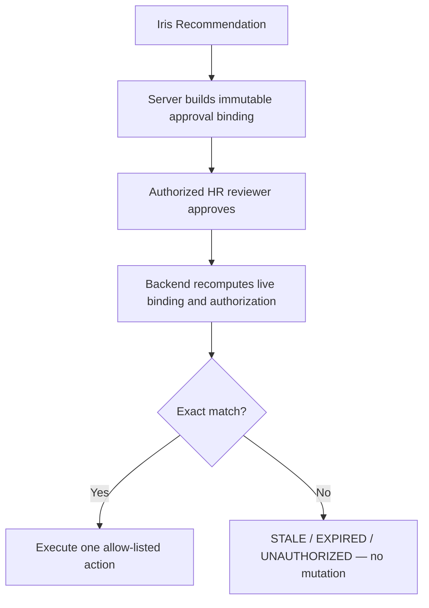
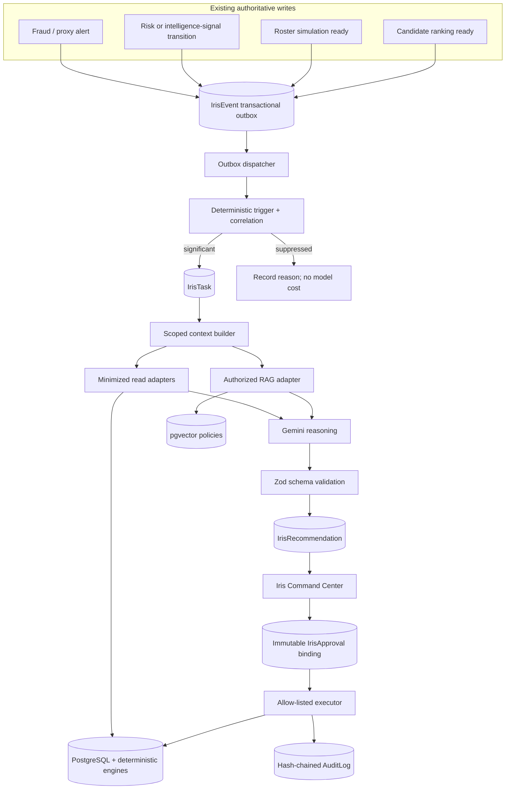

# Crew Iris — Master Implementation Plan

**Repository:** `E:\Team-Kratos`  
**Version:** 5.0 — final reconciled plan  
**Date:** 2026-08-20  
**Supersedes:** earlier Iris proactive-plan drafts. This is the single implementation baseline.

## 1. Product objective

> Iris continuously observes authorized Crew signals, identifies material changes using deterministic rules, explains them with authoritative evidence and current company policy, proposes the safest next step, and executes only within explicit human-approved boundaries.

Iris is never the authority for facts, thresholds, risk/fraud determinations, authorization, policy enforcement, or database writes.

```text
AI thinks → engines calculate → AI proposes → human approves
        → backend reauthorizes and revalidates
        → PostgreSQL transacts → audit chain records → result is verified
```

This turns Crew into a workforce operating system with accountable AI assistance, rather than adding a more capable chatbot.

## 2. Non-negotiable approval-binding rule

An approval is not a mutable Boolean and does not mean “approve whatever Iris currently recommends.” It authorizes one exact, expiring proposal under one exact scope.



### 2.1 Composite proposal binding

At proposal generation, the backend canonicalizes and hashes this server-owned object:

```json
{
  "bindingVersion": 1,
  "tenantId": "tenant scope",
  "recommendationId": "server-generated recommendation reference",
  "proposalRevision": 1,
  "proposedForActorId": "actor or system principal whose permitted scope produced it",
  "scope": {
    "resourceScope": "TENANT | DEPARTMENT | MANAGER | SELF",
    "departmentIds": [],
    "managerId": null,
    "roleCapability": "IRIS_ROSTER_APPLY"
  },
  "target": {
    "entityType": "ROSTER_SIMULATION",
    "entityRef": "safe server reference"
  },
  "actionType": "APPLY_ROSTER_SIMULATION",
  "actionParameters": {
    "simulationId": "server reference only",
    "executionMode": "IRIS_APPROVED"
  },
  "entitySnapshotFingerprint": "sha256 of exact authoritative input state",
  "policyFingerprint": "sha256 of policy chunk identifiers/versions used",
  "plannerVersion": "roster planner version",
  "expiresAt": "ISO-8601"
}
```

The SHA-256 result is `proposalFingerprint`.

`proposedForActorId` identifies the principal/scope used while producing the recommendation. It is **not** a substitute for the eventual approver: the backend still evaluates the approver’s current identity, role, tenant, and resource scope at execution time.

### 2.2 Approval record

The approval copies the immutable binding values rather than relying on a live join to a mutable recommendation:

```text
IrisApproval
  id
  tenantId
  recommendationId
  recommendationRevision
  approverId
  approvedAt
  idempotencyKey
  bindingVersion
  proposalFingerprintAtApproval
  entitySnapshotFingerprintAtApproval
  policyFingerprintAtApproval
  actionTypeAtApproval
  targetAtApproval
  actionParametersAtApproval
  scopeAtApproval
  expiresAtAtApproval
  status: PENDING | APPROVED | REJECTED | STALE_DATA | STALE_POLICY |
          EXPIRED | UNAUTHORIZED | CANCELLED
```

The browser may submit a recommendation ID and an idempotency key. It must never supply a trusted fingerprint, target, scope, role, policy version, action parameters, or approval result.

### 2.3 Execution-time comparison

Inside the execution transaction, the backend:

1. loads the approval, recommendation, target, and authoritative state in the current tenant;
2. freshly authenticates/authorizes the approver—approval-time permissions are never reused blindly;
3. validates the action type against a hard server allow-list;
4. recomputes the entity snapshot fingerprint with the **exact original generation inputs**;
5. recomputes the policy fingerprint if policy compliance was part of the proposal;
6. reconstructs the canonical binding from current server state;
7. compares every binding field and the final hash to the copied approval values;
8. executes only if all values match and the proposal has not expired.

Mismatch outcomes are explicit:

| Mismatch | Result | Mutation |
|---|---|---|
| Entity/input state changed | `STALE_DATA` | None. Regenerate proposal. |
| Policy version/chunk changed | `STALE_POLICY` | None. Re-review policy-aware proposal. |
| Approval expired | `EXPIRED` | None. Regenerate/reapprove. |
| Actor lost role/scope | `UNAUTHORIZED` | None. |
| Target/action/parameters differ | `STALE_DATA` and security audit | None. |

This rule prevents approving one proposal and accidentally executing another after state, policy, scope, or parameters changed.

## 3. Capability scope

| Level | Capability | Release decision |
|---|---|---|
| L0 — Observe | Read authorized facts, retrieve policy, summarize. | Existing Iris after hardening. |
| L1 — Analyze | Explain deterministic signals, trends, and conservative correlations. | First proactive release. |
| L2 — Propose | Persist evidence-backed recommendations and simulations. | Second proactive release. |
| L3 — Execute with approval | Execute one narrow, allow-listed action after composite binding checks. | Roster pilot only. |
| L4 — Restricted autonomy | Automatic reversible low-risk work. | Explicitly out of scope. |

### Prohibited permanently from the Iris executor

- termination, suspension, discipline, fraud determination, or employment-status action;
- payroll, salary, banking, tax, benefits, leave decision, or employee record mutation;
- any decision/scoring based on protected characteristics or biometric data;
- disclosure of secrets, credentials, government IDs, bank data, private address/contact data, raw biometric/GPS data, or cross-tenant data;
- bypass of tenancy, RBAC, ownership, department, manager, resource scope, stale checks, or human approval.

## 4. Current-code facts and reuse policy

| Existing component | Reuse decision |
|---|---|
| `chatOrchestrator.js` | Interactive chat only. Reuse bounded-context/RAG/tool patterns; never make it the background event worker. |
| `chatbotToolHandlers.js` | Source for safe, minimized read adapters. Do not pass raw ORM objects to Gemini. |
| `investigationService.js` | Source of canonical snapshot/fingerprint/stale-report behavior. Generalize this discipline rather than creating another fingerprint system. |
| `config/db.js` / `AuditLog` | Sole compliance audit ledger; retain its hash chain. Make it transaction-composable before execution. |
| `workers/cronJobs.js` | Schedule a PostgreSQL outbox dispatcher for the MVP. No Redis/BullMQ operational dependency in the initial release. |
| `rosterSimulationService.js` and `shiftEngineController.js` | Actual current roster flow. Harden and extract it into a shared application service before Iris calls it. |
| `orchestratorService.js` | Do not integrate directly. It has no reviewed caller and imports absent `shiftEngineService`; preserve product intent only. |

## 5. Phase 0 — Blocking baseline release

All items in this phase ship and pass tests before any proactive event/task/recommendation code is merged.

### P0-A: Roster application security/reliability repair

Current issues: simulation is loaded by ID without tenant predicate; fresh fingerprint is calculated but not compared; original generation inputs are not persistently available for exact revalidation; failure can strand `APPLYING`.

#### Required implementation

1. Extract `shiftEngineController.autoAssignShifts` into:

   ```js
   rosterApplicationService.applySimulation({
     tenantId,
     actorId,
     simulationId,
     executionMode, // MANUAL_ADMIN | IRIS_APPROVED
     idempotencyKey
   });
   ```

2. Ensure both the current manual-admin endpoint and Iris future executor call this same service.
3. Fetch simulations with an `id + tenantId` predicate before any action. Never fetch globally by ID then filter later.
4. Extend `RosterSimulation` to persist immutable planning input and recovery metadata:

   ```text
   input: { weekISO, blockDurationDays, plannerVersion }
   inputFingerprint
   applyingAt
   failedAt
   failureCode
   stateVersion
   ```

5. Recompute current roster state using the exact persisted input. Compare the new result with stored `currentFingerprint` before any slot/assignment write.
6. On mismatch, atomically transition to `STALE`, append audit, and return HTTP 409 with no mutation.
7. Atomically claim only a tenant-bound, non-expired `GENERATED` simulation with expected state/version.
8. Run assignment creation and terminal simulation-state update in one transaction where technically feasible. A caught failure must enter an explicit `FAILED` state; a scheduled recovery process handles abandoned `APPLYING` states conservatively and escalates ambiguous cases for manual review.
9. Verify persisted assignments/coverage after success before returning completion.

### P0-B: Transaction-aware audit chain

Refactor the existing audit hash logic into a helper that accepts the caller's Prisma transaction:

```js
appendAuditLogInTransaction(tx, {
  tenantId, actorId, action, targetId, details, ipAddress, userAgent
});
```

It must retain the current tenant advisory lock and per-tenant `prevHash → hash` chain. The Prisma extension for ordinary calls should share this core logic where practical.

The forced-rollback test must prove an aborted roster/action transaction persists neither the mutation nor its corresponding audit entry. If that cannot be technically guaranteed, execution must use a durable reconciliation design and must not claim atomic mutation-plus-audit behavior.

### P0-C: Iris HTTP/Socket authorization parity

- Build a transport-neutral `irisAccessGuard`: verified authenticated principal, tenant, enabled account, Owner/HR-Admin policy.
- Invoke it before chat session/message persistence and before `runChat` in both REST and Socket.IO.
- Apply equivalent user and tenant rate limits to `chatbot:query` sockets and REST requests.

### P0-D: RAG schema and readiness

- Add an idempotent migration for pgvector extension, `HRDocument.embedding vector(768)`, and cosine HNSW index.
- Add readiness validation for extension, vector column, configured model/dimension, and index.
- Distinguish “RAG unavailable” from “no eligible policy matched.” A policy-dependent answer must not silently proceed ungrounded.

### Phase 0 acceptance gate

| Test | Required result |
|---|---|
| Tenant A attempts to apply Tenant B simulation ID. | No record/mutation; 404/403 and audit denial. |
| Roster changes after plan generation. | `STALE_DATA`, HTTP 409, zero mutation. |
| Forced post-claim apply failure. | Observable failed/recovery state; no indefinitely stuck `APPLYING`. |
| Forced transaction rollback. | No roster/action/audit partial state. |
| Level 2 user emits Socket.IO query. | Rejected before session/message creation. |
| Vector column/index absent. | Visible readiness failure/degraded state—not false “no policy.” |

## 6. Target proactive architecture



Core rules:

- Domain write and `IrisEvent` outbox insertion are one transaction.
- Events are immutable facts; tasks are mutable work state.
- A deterministic trigger decides whether a task exists; Gemini only explains approved task context.
- Context is a versioned/minimized DTO; Gemini has no arbitrary database/tenant access.
- Recommendations are advice; actions are distinct, allow-listed commands.
- `AuditLog` is the only compliance audit stream. `IrisTaskRun` is observability telemetry.

## 7. Phase 1 — Transactional event outbox and task lifecycle

### New data models

| Model | Required responsibility |
|---|---|
| `IrisEvent` | Immutable outbox fact: tenant, unique event key, type/source/entity, minimized payload, status/retry/error timestamps. |
| `IrisTask` | Tenant-scoped workflow aggregate: event, semantic task key, task/entity type, state, priority, trigger reason, context fingerprint, optimistic revision. |
| `IrisTaskRun` | Attempt/stage/model/token/latency/status/failure telemetry. It is not another audit table. |
| `IrisRecommendation` | Validated facts/signals/policy findings/limits/recommendation/proposal plus proposal binding and expiry. |
| `IrisApproval` | Immutable approval snapshot described in Section 2. |
| `IrisExecution` | Execution status/result/verification/failure for an approved action. |
| `IrisFeedback` | Useful, incorrect, not relevant, dismissed, confirmed feedback. |

All tables have `tenantId` and tenant-leading indexes. `eventKey` deduplicates producer retries. `taskKey` deduplicates equivalent open tasks for one signal fingerprint and time window.

### Services

```text
backend/src/services/iris/
  irisEventTypes.js
  irisEventService.js
  irisEventDispatcher.js
  irisTaskService.js
  irisTriggerEngine.js
  irisCorrelationService.js
  irisContextBuilder.js
  irisReasoningService.js
  irisApprovalService.js
  irisExecutionService.js
  irisFeedbackService.js
  irisAuditAdapter.js
  adapters/{attendance,risk,intelligence,fraud,roster,recruitment,policy}Adapter.js
```

Use the existing `node-cron` setup to schedule the dispatcher. It atomically claims events, retries transient failures with bounded backoff, and moves exhausted failures to `DEAD_LETTER`. Do not blindly retry an unknown partial mutation.

### Initial producers only

| Event | Existing source | First behavior |
|---|---|---|
| `FRAUD_ALERT_CREATED` | Proxy alert creation paths | Analyze only high/critical unresolved alert. |
| `RISK_SCORE_CHANGED` | Risk cron update | Analyze only high/critical threshold crossing. |
| `INTELLIGENCE_SIGNAL_CHANGED` | Pattern signal lifecycle/write | Analyze configured high/critical signal. |
| `ROSTER_SIMULATION_READY` | Simulation persistence | Inform/propose only. |
| `APPLICATION_RANKING_READY` | Candidate-ranking persistence | Inform only. |

Attendance, leave, application-upload, compliance, and cost streams are deferred; no broad event is added until significance quality is measurable.

### Task state machine

```text
PENDING → QUEUED → ANALYZING → INFORMED
                            └→ PROPOSED → WAITING_APPROVAL → EXECUTING → COMPLETED
                                                  ├→ REJECTED
                                                  ├→ STALE_DATA / STALE_POLICY
                                                  └→ EXPIRED
```

Each transition includes expected `revision`. Terminal tasks do not reopen; updated evidence produces a new fingerprint/task.

**Phase 1 gate:** domain/event rollback is atomic, duplicates cannot create duplicate work, multiple dispatchers cannot double-claim, and suppression creates no Gemini call.

## 8. Phase 2 — Deterministic triggering, evidence, and correlation

`irisTriggerEngine` returns only `IGNORE`, `INFORM`, `ANALYZE`, or `PROPOSE_ELIGIBLE`, with a persisted deterministic reason.

Example policies:

- high/critical unresolved proxy alert → `ANALYZE`;
- verified risk-band crossing into high/critical → `ANALYZE`;
- valid unexpired roster simulation with measured benefit → `PROPOSE_ELIGIBLE`;
- candidate ranking complete → `INFORM` only.

### Context builder security order

```text
tenant → actor capability/RBAC → resource ownership → department/manager scope
       → task data contract → minimized retrieval → redaction → model context
```

Adapters are read-only, reuse existing Crew engines/services, and return safe DTOs only. They must not return raw Prisma models, UUIDs, credentials, bank/government data, private contact/address, raw GPS/biometric data, or unrelated payroll data.

Use the exact canonicalization/SHA-256 approach from `investigationService.js` for evidence snapshots. Conflicting authoritative facts return `CONFLICTING_DATA` with limitation, never a personnel accusation or action.

Correlations are conservative. For department work-exposure, require all configured signals in the window—data completeness, attendance change, overtime change, and independent risk/intelligence evidence. State “elevated workload exposure,” not burnout or a causal claim.

**Phase 2 gate:** unauthorized requests return zero data before adapters run; qualified correlation yields one deduplicated task; partial combinations do not fire; conflicts cannot enter proposal/execution path.

## 9. Phase 3 — Grounded reasoning and recommendations

Gemini receives a bounded/redacted context DTO and authorized RAG chunks. It must follow:

```text
facts → evidence → deterministic signals → policy context
      → assessment → limitations → recommendation → optional proposal
```

Authority order is fixed in backend code:

1. PostgreSQL system-of-record facts;
2. deterministic Crew engines;
3. authorized/current policy chunks;
4. Gemini interpretation;
5. explicitly labelled non-decisive inference.

Validate all model output with Zod before persistence. Invalid/malformed/oversized output is `LLM_FAILURE`; it cannot become a recommendation or action.

| Condition | Allowed result |
|---|---|
| Insufficient/conflicting data or confidence <0.70 | Informational only. |
| 0.70–0.89 | Recommendation only. |
| ≥0.90 and action-policy conditions pass | Approval-eligible proposal, never direct action. |

Confidence means evidence/data sufficiency, not likelihood of wrongdoing or a personnel conclusion.

Use no model call for simple deterministic lookup/aggregation. Cap task context, model calls, retrieval chunks, token budget, wall time, and retries; record operational metrics in `IrisTaskRun`.

**Phase 3 gate:** malformed output cannot persist recommendation; RAG outage is visible; every published recommendation includes evidence/source/limits/human next step; no business mutation occurs.

## 10. Phase 4 — Iris Command Center

Build a dedicated Owner/HR Admin view, not an expanded chat drawer.

- Prioritized active tasks with evidence count and source freshness.
- Detail view: trigger rule, facts, policy relevance, limitations, confidence semantics, feedback/dismiss/review controls.
- Persisted brief from tasks and versioned metrics, including honest empty/no-data state.
- Roster proposal review card with no hidden/direct execution.
- Event → task → recommendation → approval → execution/audit timeline.

Expose tenant-scoped REST endpoints for dashboard, paginated tasks, task detail, justified dismissal, feedback, and current brief. Socket.IO only sends “data changed”; clients refetch authorized REST data rather than receiving sensitive push payloads.

**Phase 4 gate:** tenant/resource isolation holds across list/detail endpoints; no fabricated empty-state insight; pagination scales; feedback persists.

## 11. Phase 5 — Single L3 pilot: approved roster application

Start only after Phase 0 roster and audit controls are live/verified.

| Action | Rule |
|---|---|
| `REFRESH_REPORT` | Allowed, non-mutating. |
| `CREATE_ROSTER_PROPOSAL` | May create/link simulation, no roster mutation. |
| `APPLY_ROSTER_SIMULATION` | Only executable pilot; composite approval binding required. |
| Any other action | Hard server rejection. |

### Execution sequence

1. Authorized reviewer requests approval with a tenant-scoped `Idempotency-Key`.
2. Backend creates immutable approval binding from server state; the UI cannot choose its values.
3. At execute, lock approval/action/recommendation and reauthorize reviewer fresh.
4. Recompute entity, policy, scope, target, action parameters, expiry, planner version, and composite proposal fingerprint.
5. A mismatch produces exact stale/unauthorized status, hash-chained audit, and no mutation.
6. Match permits the hardened shared `rosterApplicationService` to apply the simulation.
7. Within the transaction, record execution/audit; post-verify persistence/invariants; return stored result for idempotent replay.

**Phase 5 gate:** stale data/policy causes zero mutation; tenant escape fails; approval races produce one execution; forced failure has known recovery; each action has recommendation, immutable approval binding, fingerprints, audit record, telemetry, and verifier evidence.

## 12. Phase 6 — Reliability and measured expansion

- dead-letter/replay procedure;
- bounded retries only for transient model/network failures;
- health checks for RAG readiness, outbox age, stuck task/action state, stale approvals, excess retry, and abnormal cost;
- retention/deletion policy for snapshots, prompts, tasks, and feedback;
- dashboards for trigger/suppression volume, false positives, dismissals, usefulness, approval rate, action failures, and cost per resolved task;
- no new execution type until predeclared quality/safety thresholds hold for a full release period.

## 13. Required adversarial tests

| Case | Expected behavior |
|---|---|
| Tenant A attempts any UI/socket/API/RAG access to Tenant B data. | Denied before retrieval; zero data. |
| Lower-level user emits raw Socket.IO Iris query. | Rejected before session/message/task persistence. |
| Document/resume tells Iris to ignore rules. | Untrusted data only; no effect on authorization/action. |
| Model asks for forbidden/unknown action. | Server rejects; audit logged; no execution. |
| No source evidence exists. | `INSUFFICIENT_DATA`, no proposal. |
| Authoritative sources conflict. | `CONFLICTING_DATA`, no accusation/action. |
| Roster changes after proposal. | `STALE_DATA`, no mutation. |
| Policy changes after policy-aware proposal. | `STALE_POLICY`, no mutation. |
| Proposal target/parameters/scope are tampered with. | Binding mismatch, audit, no mutation. |
| Approval double click/concurrent reviewers. | Exactly one execution/result. |
| RAG schema missing. | Visible degraded state, not false no-policy answer. |
| Event storm. | Dedupe/budget stops unbounded task/model fan-out. |

## 14. Ordered backlog

1. Runnable tests and two-tenant/role fixtures.
2. Phase 0 roster boundary, audit transaction helper, Socket.IO guard/limits, and RAG readiness migration.
3. Event/task/task-run schema, transactional outbox, dispatcher.
4. Fraud/risk/signal/roster-simulation/ranking producers only.
5. Trigger engine, dedupe, task FSM, worker health.
6. Context builder, minimized adapters, fingerprints, RAG adapter, conflict/insufficient-data outcomes.
7. Schema-validated reasoning and persisted recommendations—still read-only.
8. Command Center, brief, detail, feedback, dismissal.
9. Immutable composite approval binding and roster-only execution pilot.
10. Use reliability/feedback evidence to decide whether any future action type is warranted.

## Completion standard

Iris is ready only when every request, event, task, recommendation, approval, and action is authenticated or from a trusted producer; tenant-scoped; data-minimized; source-grounded; schema-validated; bound to exact scope/target/action/fingerprint/expiry; hash-chain audited; adversarially tested; and human-controlled.
