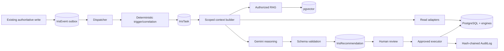

# Iris Proactive Intelligence & Controlled-Execution Plan — v4

**Repository:** `E:\Team-Kratos`  
**Date:** 2026-08-20  
**Status:** implementation plan; no behavior changes are made by this document.

## Executive decision

Crew should build Iris as an evidence-backed, human-controlled orchestration layer—not an autonomous HR actor.

```text
Authoritative record/event
  → deterministic significance rule
  → tenant-scoped evidence snapshot
  → deterministic engines + authorized policy retrieval
  → Gemini explanation validated against schema
  → recommendation
  → human decision
  → backend reauthorization + stale check
  → transaction + audit + verification
```

**Non-negotiable rule:** AI thinks; Crew engines calculate; AI proposes; a human approves; the backend validates; PostgreSQL transacts; the existing audit chain records.

Gemini is never the source of truth, an authorization authority, a policy enforcer, or a direct database actor.

## 1. Critical baseline findings and immediate priorities

The planned L3 action, applying a roster simulation, is **not a safe primitive today**. These are existing-code defects and must be fixed before proactive work proceeds.

| ID | Verified current condition | Risk | Required outcome |
|---|---|---|---|
| P0-A | `shiftEngineController.autoAssignShifts` fetches a `RosterSimulation` by `id` with no `tenantId` condition. | A guessed/captured ID can cross tenant boundaries on a mutation path. | Immediate tenant-bound lookup and authorization test. |
| P0-B | It calculates `freshFingerprint` but never compares it with `simulation.currentFingerprint`. | A changed roster can receive an obsolete plan. | Exact-input fingerprint comparison; mismatch is `STALE`, with zero mutation. |
| P0-C | The simulation lacks persisted original generation inputs; current recheck calls `generateRosterPlan(tenantId, null, 7)`. | The system cannot reliably recompute the fingerprint for a simulation created for a different week/duration. | Persist immutable simulation input (`weekISO`, `blockDurationDays`, planner version) and use it during revalidation. |
| P0-D | The request atomically claims `GENERATED → APPLYING`, but a later failure can strand status in `APPLYING`; process crashes require recovery too. | A plan becomes stuck or operational state becomes ambiguous. | Add failure metadata/time, deterministic recovery, and a watchdog. |
| P0-E | The current audit Prisma extension creates its own base-Prisma transaction. | A mutation plus audit record cannot be assumed atomic in a future action transaction. | Factor existing hash-chain logic into a transaction-aware helper. |
| P0-F | Iris Socket.IO `chatbot:query` does not apply REST’s universal `authorize(1)` and chat limit middleware. | A lower-privilege authenticated socket can bypass intended Iris restrictions. | Shared HTTP/socket access and rate controls. |
| P0-G | RAG code expects `HRDocument.embedding vector(768)`, but reviewed migrations do not visibly create it. | Policy retrieval can degrade silently to empty context. | Idempotent vector migration plus loud readiness/degraded behavior. |

**Release rule:** P0-A through P0-G are a single blocking security/reliability release. No event bus, command center, recommendation, or Iris execution code is deployed ahead of it.

## 2. Scope and capability policy

| Level | Capability | Release decision |
|---|---|---|
| L0 — Observe | Read authorized facts, retrieve policy, summarize. | Existing Iris after Phase 0 hardening. |
| L1 — Analyze | Detect deterministic patterns/correlations and explain evidence. | First proactive release. |
| L2 — Propose | Store recommendations and non-mutating simulations. | Second proactive release. |
| L3 — Execute with approval | Execute a single allow-listed mutation after full approval/revalidation. | Roster pilot only. |
| L4 — Restricted autonomy | Execute explicitly reversible low-risk tasks automatically. | Out of scope until measurable quality/reliability targets are met. |

### Hard server-side prohibitions

No version of Iris may automatically or manually-through-model execution:

- terminate, suspend, discipline, or determine that an employee committed fraud;
- change payroll, salary, banking, taxation, benefits, leave decisions, or employee status;
- rank/decide using protected characteristics or biometric data;
- disclose credentials, government IDs, bank details, private contact/address, biometric data, raw GPS, or another tenant’s data;
- override tenancy, RBAC, ownership, department, manager scope, or approval rules.

## 3. Existing components to reuse—and those not to reuse yet

| Component | Decision |
|---|---|
| `chatOrchestrator.js` | Retain as the interactive-chat path. Reuse its query classification, constrained-tool, bounded-history, and RAG principles; do not convert it into a background worker. |
| `chatbotToolHandlers.js` | Reuse its safe output-shaping approach when creating proactive read adapters. Never send raw Prisma objects to Gemini. |
| `investigationService.js` | Reuse its canonical JSON/SHA-256 snapshot and stale-cache model for tasks/recommendations/actions. Do not invent a second fingerprint scheme. |
| `config/db.js` + `AuditLog` | Retain as the only compliance audit system. `IrisTaskRun` will be observability telemetry, not a second audit ledger. |
| `workers/cronJobs.js` | Use to invoke a PostgreSQL outbox dispatcher in the MVP. Do not introduce Redis/BullMQ infrastructure without a demonstrated throughput/retry-isolation need. |
| `rosterSimulationService.js` + `shiftEngineController.js` | This is the real roster simulation/apply path. Harden and extract it into a shared domain service first. |
| `orchestratorService.js` | Do not use it as an integration primitive: it has no reviewed route caller and imports missing `shiftEngineService`. Preserve only its product intent; retire/refactor it later to delegate to the active shared roster service. |

## 4. Target architecture



Design rules:

1. **Transactional outbox:** business write and event insertion commit or roll back together.
2. **Events versus tasks:** an event is immutable fact; a task is mutable work state.
3. **Deterministic activation:** a policy/engine decides significance, not Gemini.
4. **Minimized context:** the model receives a versioned DTO, not broad database access.
5. **Recommendations versus actions:** model text cannot choose an arbitrary executor/target/tenant/action.
6. **One audit authority:** approval/action transitions use Crew’s existing hash chain through a transaction-aware append helper.

## 5. Phase 0 — Blocking security and reliability release

### P0.1 Hotfix roster execution boundary

Refactor controller logic into:

```js
rosterApplicationService.applySimulation({
  tenantId,
  actorId,
  simulationId,
  executionMode, // MANUAL_ADMIN | IRIS_APPROVED
  idempotencyKey
});
```

The existing manual endpoint may remain available to authorized administrators, but it and the future Iris path must invoke this same service. There must be one implementation of tenant validation, stale protection, execution state, and post-action verification.

#### Required changes

1. Read the simulation with `where: { id: simulationId, tenantId }` or equivalent tenant-bound `findFirst`; never load it globally then compare later.
2. Add immutable simulation inputs in a migration, for example:

   ```text
   input: { weekISO, blockDurationDays, plannerVersion }
   inputFingerprint
   applyingAt
   failureCode
   failedAt
   stateVersion
   ```

   Persist inputs at generation time. Recompute current source state with the exact original inputs—not `null, 7`.
3. Atomically claim only a tenant-bound, unexpired `GENERATED` simulation. Require an expected state/version.
4. Compare `freshCurrentFingerprint` to stored `currentFingerprint` before planning mutations. If they differ, mark `STALE`, append audit, and return HTTP 409 with no assignment/slot operation.
5. Execute roster mutations and terminal simulation update in one transaction when the existing domain operations can participate safely.
6. On a caught execution failure, record `FAILED`/failure code safely. For a process crash, run a scheduled recovery job that finds simulations stuck beyond a bounded `APPLYING` duration, verifies that no successful mutation occurred, and marks them `FAILED` or escalates them for manual recovery. Never silently reset a potentially partially applied plan.
7. After a successful apply, independently verify required assignment/coverage invariants before reporting success.

### P0.2 Make AuditLog transaction-composable

Refactor the hash-chain implementation—not the audit domain—so code can append an audit entry within an existing transaction.

```text
appendAuditLogInTransaction(tx, {
  tenantId, actorId, action, targetId, details, ipAddress, userAgent
})
```

The helper must acquire the same tenant advisory lock, read the preceding chain value through `tx`, calculate `prevHash`/`hash`, and create the `AuditLog` row through that same `tx`. The existing Prisma extension should delegate to the shared core where possible. Tests must prove a transaction rollback leaves neither roster mutation nor audit row.

### P0.3 Restore Iris transport parity

- Create a shared `irisAccessGuard` with verified identity, tenant presence, account status, and owner/HR-admin level policy.
- Call it before chat sessions/messages and before `runChat` in both REST and Socket.IO.
- Apply the same per-user/per-tenant rolling limits to HTTP and socket events.
- Test lower-level authenticated sockets, not only unauthenticated connections.

### P0.4 Repair RAG schema/readiness

- Add an idempotent migration for `CREATE EXTENSION IF NOT EXISTS vector`, `HRDocument.embedding vector(768)`, and a cosine HNSW index.
- Add startup/readiness validation for extension, column, configured embedding dimension/model, and index.
- Distinguish **RAG unavailable** from **no eligible document matched** in retrieval and in user-facing policy answer behavior.
- Test document retrieval across tenants, access levels, lifecycle state, and effective/expiry dates.

### P0 acceptance tests

| Test | Required result |
|---|---|
| Tenant A sends Tenant B roster simulation ID to apply endpoint. | 404/403; no mutation, no state change, auditable denial. |
| Roster changes after simulation generation. | 409 `STALE`; no mutation. |
| Roster apply error after claim. | Terminal observable failed/recovery state; no stranded indefinite `APPLYING`. |
| Transaction rollback after a forced failure. | No roster mutation and no action/audit row for that transaction. |
| Level 2 socket sends `chatbot:query`. | Rejected before chat persistence. |
| pgvector schema missing. | Visible readiness failure/degraded mode; policy response does not falsely say no policy exists. |

## 6. Phase 1 — Durable event and task foundation

### Data model

| Model | Essential fields | Purpose |
|---|---|---|
| `IrisEvent` | `tenantId`, unique `eventKey`, type, entity type/reference, source, minimized payload, status, attempts, backoff/error timestamps | Immutable transactional outbox. |
| `IrisTask` | `tenantId`, unique semantic `taskKey`, event, type, state, priority, trigger reason, context fingerprint, revision | Mutable work lifecycle. |
| `IrisTaskRun` | task, attempt/stage, model, token/latency, status/failure | Operational telemetry, not an audit ledger. |

Every model includes tenant-leading indexes. `eventKey` deduplicates producer retry; `taskKey` deduplicates equivalent open work in a defined fingerprint/window.

### Services

```text
backend/src/services/iris/
  irisEventTypes.js
  irisEventService.js
  irisEventDispatcher.js
  irisTaskService.js
  irisTriggerEngine.js
```

The dispatcher is scheduled through the existing cron process and claims pending rows atomically. It supports bounded retry/backoff and `DEAD_LETTER`; it never reruns an unknown partial action blindly.

### First event producers

| Event | Existing source | Initial action |
|---|---|---|
| `FRAUD_ALERT_CREATED` | proxy alert creation in attendance/cron paths | Analyze high/critical unresolved alert. |
| `RISK_SCORE_CHANGED` | risk update in cron job | Analyze high/critical threshold crossing only. |
| `INTELLIGENCE_SIGNAL_CHANGED` | pattern signal write/lifecycle | Analyze configured high/critical signal. |
| `ROSTER_SIMULATION_READY` | simulation persistence | Inform/propose only. |
| `APPLICATION_RANKING_READY` | candidate ranking persistence | Inform only. |

No blanket attendance/leave/application event stream in v1. It would add noise and AI cost before the trigger policy has evidence of value.

### Task state policy

```text
PENDING → QUEUED → ANALYZING → INFORMED
                            └→ PROPOSED → WAITING_APPROVAL → EXECUTING → COMPLETED
                                                  ├→ REJECTED
                                                  ├→ STALE
                                                  └→ EXPIRED
```

Use an expected `revision` on each transition. Terminal tasks do not reopen; new source evidence produces a new task/fingerprint.

**Phase 1 gate:** event/domain write rollback is atomic; duplicates do not create duplicate work; competing dispatchers cannot double-claim; ignored events explain why and make zero Gemini calls.

## 7. Phase 2 — Deterministic triggers and scoped evidence context

### Trigger outcomes

`irisTriggerEngine` produces only `IGNORE`, `INFORM`, `ANALYZE`, or `PROPOSE_ELIGIBLE` based on deterministic configuration/rules. It records the rule that activated or suppressed the task.

Examples:

- high/critical unresolved fraud alert → `ANALYZE`;
- risk label enters high/critical with sufficient deterministic evidence → `ANALYZE`;
- valid unexpired roster simulation with measured improvement → `PROPOSE_ELIGIBLE`;
- candidate ranking completion → `INFORM` only.

### Context-builder authorization order

```text
tenant → actor capability/RBAC → resource ownership → department/manager scope
       → task data contract → minimized source retrieval → redaction → model context
```

Create read-only adapters for attendance, risk, intelligence signals, fraud alerts, roster simulations, recruitment, and policy/RAG. They reuse existing engine/service data but return safe DTOs only. No adapter can expose sensitive identifiers, credentials, internal UUIDs, raw biometrics/GPS, unrelated payroll, or full user models.

### Fingerprinting and conflicts

Use the canonicalization/SHA-256 approach already in `investigationService.js`. Store the evidence snapshot and fingerprint at task/recommendation time. If authoritative records differ before review/execution, mark stale and regenerate.

Conflicting evidence produces `CONFLICTING_DATA` and an explicit limitation, not a fraud/personnel accusation or a proposal.

### Correlations

Add only after individual triggers pass production-quality tests. A department work-exposure correlation must require all configured evidence in the time window—data completeness, attendance change, overtime change, and independent risk/intelligence signal. It may report elevated workload exposure; it may not claim burnout or causation.

**Phase 2 gate:** unauthorized context returns no data before adapter calls; qualified correlation produces one deduplicated task; partial signals do not fire; conflicts cannot enter an action path.

## 8. Phase 3 — Grounded explanation and recommendations

Gemini receives only a bounded, redacted context DTO and authorized RAG chunks. It must return schema-validated output following:

```text
Facts → evidence → deterministic signals → policy context
      → assessment → limitations → recommendation → optional proposal
```

Source authority is fixed in code:

1. PostgreSQL system-of-record facts;
2. deterministic Crew engines;
3. authorized/current policy chunks;
4. Gemini interpretation;
5. clearly labelled non-decisive inference.

Required output fields include summary, facts with safe source references, signals/severity/confidence, policy findings, assessment, limitations, recommendation, optional proposal, and `humanApprovalRequired`. Validate with Zod before persistence. Invalid/malformed/oversized output becomes `LLM_FAILURE`, never a repaired action.

| Condition | Result |
|---|---|
| Insufficient/conflicting data or confidence below 0.70 | Informational only. |
| 0.70–0.89 | Recommendation only. |
| 0.90+ and action-policy conditions pass | Approval-eligible proposal only. |

Confidence measures data/pattern sufficiency, not truth, misconduct probability, or a personnel conclusion.

Use no model for deterministic lookup/aggregation. Bound model calls, record count, RAG chunks, token budget, retry count, and wall time per task. Record operational metrics in `IrisTaskRun`.

**Phase 3 gate:** malformed model output cannot persist a recommendation; no prohibited field reaches Gemini; policy retrieval outage is explicit; every published recommendation shows facts, sources, limits, and human next step.

## 9. Phase 4 — Proactive user experience

Build a dedicated Owner/HR Admin Iris Command Center, not an expanded chat drawer.

It includes:

- prioritized active tasks with source freshness and evidence count;
- task detail: trigger rule, facts, policy relevance, limitations, confidence semantics, feedback/dismiss/review controls;
- persisted brief generated from tasks/versioned metrics, with honest empty/no-data state;
- proposed roster review card, but no hidden/direct execution;
- event → task → recommendation → approval → action audit timeline.

Add tenant-scoped REST endpoints for dashboard, paginated tasks, task detail, justified dismissal, recommendation feedback, and current brief. Socket.IO sends a lightweight “data changed” notification only; the client refetches authorized REST content rather than receiving sensitive payload broadcasts.

**Phase 4 gate:** no cross-tenant task visibility; no fabricated positive/empty insight; pagination performs against expected volume; user feedback persists for quality evaluation.

## 10. Phase 5 — L3 pilot: approved roster application only

Only start once all Phase 0 roster corrections are live and verified.

### Allow-list

| Action | Pilot rule |
|---|---|
| `REFRESH_REPORT` | Low-risk, non-mutating; allowed. |
| `CREATE_ROSTER_PROPOSAL` | Creates/links a simulation; never mutates roster. |
| `APPLY_ROSTER_SIMULATION` | The only mutation; approval required. |
| Everything else | Server hard-rejection. |

### Approval protocol

1. An authorized actor asks to review/approve a recommendation using an `Idempotency-Key`.
2. The backend authenticates, applies tenant/RBAC/resource scope, loads the linked recommendation and action, and locks relevant rows.
3. It checks action allow-list, expiry, expected state/version, and exact current fingerprint.
4. If stale/invalid, it writes `STALE` with transaction-aware audit and returns without mutation.
5. If valid, it writes executing state + audit and invokes the shared roster application service.
6. The roster service mutates/marks complete in a transaction, appends hash-chain audit through the transaction-aware helper, then post-verifies its result.
7. Replayed idempotency keys return the stored result; concurrent approvals yield one execution only.

If a shared atomic transaction is not technically achievable across the roster mutation and audit, do not call the path atomic. Implement a durable execution/reconciliation design before exposure.

**Phase 5 gate:** stale plan gives zero mutation; cross-tenant simulation fails; concurrent approval yields exactly one result; forced failures have known recovery; every action has recommendation, approval, fingerprint, `AuditLog`, telemetry, and verification evidence.

## 11. Phase 6 — Reliability, governance, and measured expansion

- event dead-letter queue/replay procedure;
- bounded retry for transient network/model failure only;
- health checks for RAG readiness, event backlog age, stuck task/action states, stale approvals, excessive retry, and abnormal model cost;
- retention/deletion policy for evidence snapshots, chat prompts, feedback, and task history;
- dashboards for triggers, suppression, false positives, dismissals, recommendation usefulness, approval rate, execution failure, and cost per resolved task;
- no additional L3 action until metrics meet predeclared quality and safety thresholds for a full release period.

## 12. Mandatory adversarial and release tests

| Case | Expected behavior |
|---|---|
| Tenant A uses any UI/socket/API/RAG path to request Tenant B data. | Denied before retrieval; zero data returned. |
| Lower-level user sends raw Socket.IO Iris event. | Rejected before session/message/task creation. |
| A policy/resume/note asks Iris to ignore controls. | Treated as untrusted data; no authorization/action effect. |
| Model recommends unknown/forbidden action. | Hard policy rejection, existing audit record, no action. |
| No source evidence for conclusion. | `INSUFFICIENT_DATA`, no proposal. |
| Conflicting engine outputs. | `CONFLICTING_DATA`, no accusation/action. |
| Roster changes after plan generation. | `STALE`, zero mutation. |
| Two approvals/double click. | One mutation/result only. |
| RAG schema unavailable. | Visible readiness/degraded state, never false “no policy.” |
| High-volume event burst. | Dedupe/budget limits prevent unbounded task/model fan-out. |

## 13. Ordered implementation backlog

1. Add runnable backend tests and tenant/role fixtures.
2. Ship P0 roster boundary, transaction-aware audit, Socket.IO guard, and RAG readiness fixes together.
3. Add `IrisEvent`, `IrisTask`, `IrisTaskRun`, transactional outbox, and dispatcher.
4. Wire only fraud, risk-transition, intelligence-signal, roster-simulation-ready, and ranking-ready producers.
5. Implement deterministic trigger rules, dedupe, lifecycle FSM, and worker health visibility.
6. Add read adapters, minimization/redaction, fingerprint snapshots, RAG policy adapter, and conflict/insufficient-data outcomes.
7. Add schema-validated reasoning and persisted recommendations; retain read-only behavior.
8. Ship Command Center, task detail, brief, feedback, and dismissal workflow.
9. Pilot approval-protected roster application using only the hardened shared roster service.
10. Use reliability/feedback metrics to decide whether any future action type is justified.

## Completion standard

Iris is ready only when every request, event, task, recommendation, approval, and action is authenticated or issued by a trusted producer; tenant-scoped; data-minimized; source-grounded; schema-validated; auditable; tested under adversarial conditions; and subject to human control. It is not ready merely because the model returns convincing text or the user interface renders.
